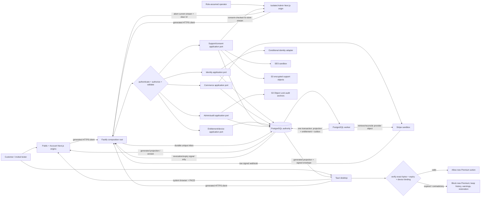

# Phase 4: Identity, Commerce, Devices, and Administration - Research

**Researched:** 2026-08-04
**Domain:** Identity, subscription commerce, device licensing, consent-bound support, and isolated administration
**Confidence:** MEDIUM

<user_constraints>

## User Constraints (from CONTEXT.md)

### Locked Decisions

### Identity, authentication, sessions, and recovery

- **D-01:** Launch authentication methods are verified email/password, Google, Discord, and passkeys. Microsoft is not a launch provider.
- **D-02:** Email/password registration requires address verification. Passkeys are offered immediately after the first verified login and may be deferred without persistent pressure.
- **D-03:** Customer MFA is optional for ordinary use but step-up authentication is mandatory for sensitive actions such as changing security methods, transferring a PC, requesting a refund, or accessing protected data.
- **D-04:** Launch second factors are authenticator applications, passkeys, and recovery codes. SMS and email codes are not accepted as second factors.
- **D-05:** Recovery first uses verified email and recovery codes. Loss of every factor escalates to security-reviewed support recovery rather than immediate email-only takeover.
- **D-06:** Exceptional support recovery restores basic access but blocks critical actions for 24 hours by default. Risk signals may extend the hold, and already-trusted sessions are notified and may contest the recovery.
- **D-07:** The one-PC rule applies only to Premium licensing, not account access. Users may hold multiple visible, individually revocable web and desktop sessions.
- **D-08:** Administrative identity never becomes one omnipotent production super-admin. Support, Operations, Security, and Audit remain separate active roles.
- **D-09:** A non-production developer identity may assume any administrative role one at a time. Every role assumption and action is audited, and the identity may receive permanent Premium only as an explicitly non-production test grant.
- **D-10:** Phase 4 authentication is real on desktop as well as web. Desktop authentication opens the system browser, uses PKCE and a secure callback, never handles social-provider passwords, and stores account tokens in Windows Credential Manager rather than localStorage or SQLite.

### Commerce and subscription lifecycle

- **D-11:** Carry forward the Phase 3 commercial contract: Free has no trial or card requirement; Premium costs R$ 29,90 monthly or R$ 249,90 annually in PT-BR and US$ 6.99 monthly or US$ 59.99 annually in English; card supports monthly/annual and Pix supports annual.
- **D-12:** A failed recurring renewal enters a seven-day grace period with retries and clear notices. Premium expires only after the grace period ends.
- **D-13:** Monthly-to-annual migration is immediate and applies proportional credit for the unused monthly period. Annual-to-monthly migration takes effect only after the paid annual period ends.
- **D-14:** The first subscription payment has a seven-day full self-service refund window. Confirmed refund ends Premium but never removes existing changes, diagnostic history, security warnings, or restoration.
- **D-15:** Duplicate charge, fraud, or proven service-failure refund claims outside the automatic window receive prioritized review rather than an invented automatic outcome.
- **D-16:** Checkout return pages never activate Premium. Until an authoritative provider event is reconciled, the account shows a truthful payment-pending state and refreshes automatically.
- **D-17:** Delayed, duplicated, replayed, or reordered payment events cannot duplicate charges, invoices, subscriptions, or entitlements.
- **D-18:** Cancellation preserves Premium through the already-paid cycle. The user may undo cancellation before that date without being charged again for the same period.
- **D-19:** Annual Pix renewal is manual. Each new period requires a fresh authorized payment, preceded by reminders; there is no silent Pix renewal at launch.
- **D-20:** Price changes require at least 30 days' notice and apply only at renewal. Already-paid periods never change price.
- **D-21:** A charge dispute or fraud review restricts new Premium actions during investigation but preserves existing changes, local history, warnings, and restoration.

### Device identity, transfer, and offline Premium

- **D-22:** The authoritative offline Premium window is seven days. This explicitly supersedes Phase 3 D-93's 30-day statement and aligns with IDEN-06 and the Phase 4 success criteria.
- **D-23:** First-PC activation is explicitly confirmed inside the desktop app after showing a friendly device name, protected identity, and the consequences of consuming the one-PC entitlement. The web account reflects the same device.
- **D-24:** Device identity is privacy-preserving and tolerant. Raw serials/HWID are never stored; reinstallations and minor upgrades do not consume a transfer.
- **D-25:** A substantial hardware change opens an explainable revalidation instead of silently granting or permanently blocking a new device.
- **D-26:** An ordinary transfer before the 30-day cooldown ends leaves the current PC active and shows the eligibility date. It must not strand the user without a licensed PC.
- **D-27:** Loss or theft permits immediate revocation. A replacement still waits for eligibility unless support grants a security-reviewed exception.
- **D-28:** A support exception is a single-use, audited authorization valid for 24 hours after strong reauthentication and review. The user, not the operator, confirms the replacement binding; the former PC is revoked as part of replacement.
- **D-29:** Offline expiry never interrupts an active game, in-progress Premium operation, or required restoration. It blocks the next Premium action or session.
- **D-30:** The signed offline authorization renews automatically when connectivity returns. Normal renewal is silent; the product surfaces only approaching expiry, contradiction, or required action.
- **D-31:** Clock rollback, corrupted entitlement data, or contradictory evidence fails safely: new Premium actions stop until online verification, without accusing the user of fraud and without blocking safety functions.

### Support, diagnostic consent, and administration

- **D-32:** A support request is a threaded case inside the account with status, priority, history, consented attachments, and expected response. Email is a notification channel, not the authoritative case record.
- **D-33:** Carry forward the public support contract: Free receives documentation/community/email with response within 72 business hours; Premium receives an initial response within 24 business hours; billing, security, and restoration incidents remain prioritized regardless of plan.
- **D-34:** Diagnostic consent is scoped to one case, one stated purpose, and explicit field classes for at most 72 hours. The user may revoke at any time.
- **D-35:** Consent expiry or revocation ends access immediately, including an operator's current view, and discards usable temporary copies. Continuing requires fresh consent.
- **D-36:** Revocation does not erase the immutable record of what was already accessed, by whom, for what purpose, and under which consent.
- **D-37:** Critical administrative actions require recent passkey/MFA reauthentication, mandatory reason, impact review, explicit confirmation, and an immutable event.
- **D-38:** Bulk or irreversible administrative actions remain unavailable until two-person approval can be enforced. A solo developer cannot bypass this through a general-admin role.
- **D-39:** Cross-role case handoff is explicit and justified. Only the minimum necessary data moves to the new role, and access that is no longer justified is removed.
- **D-40:** Support attachments and diagnostic packages are removed no later than 30 days after case closure. Only the minimum receipt, consent, checksum, and required audit evidence remain.
- **D-41:** A closed case may be reopened for 14 days, but old diagnostic consent never reactivates. Later contact creates a related new case.
- **D-42:** Break-glass access never exposes user-provided diagnostic content without valid consent. Emergency containment may reveal only minimum redacted metadata under strong authentication, short expiry, reason, alerting, and immutable audit.

### Persistence, minimization, and audit integrity

- **D-43:** PostgreSQL is authoritative for identity, sessions, subscriptions, invoices, entitlements, device bindings, support metadata, consent, and audit indexes. Cache is never authority.
- **D-44:** Neon supplies isolated development, preview, and staging PostgreSQL branches populated only with synthetic/non-production data. Production data is never cloned into these environments.
- **D-45:** Local and CI integration tests may use isolated PostgreSQL/Testcontainers. Docker Desktop is not required for ordinary local development; Node runs the API directly against Neon when desired.
- **D-46:** Administrative and security audit events are append-only. Application credentials cannot update or delete them; corrections append new events.
- **D-47:** Audit events form a verifiable chain and periodically anchor checkpoints in separate object storage so privileged database alteration becomes detectable. This does not require event-sourcing the entire product.
- **D-48:** Account deletion uses strong reauthentication and a cancelable seven-day pending period. Afterward, ordinary profile, session, consent, and support content is deleted or anonymized.
- **D-49:** Legally necessary billing, antifraud, security, and audit records may remain only in minimized form, for a documented purpose and bounded retention period.
- **D-50:** PostgreSQL stores only necessary password hashes, passkey public material, provider identifiers, protected device derivations, billing metadata, and object references. It never stores reversible passwords, full card details, raw desktop tokens, raw hardware serials, or diagnostic files as table payloads.
- **D-51:** Support attachments live in object storage with independent encryption, access, and deletion controls; PostgreSQL retains only authoritative metadata, consent, checksums, and lifecycle state.

### Shared account truth across web and desktop

- **D-52:** Use a hybrid local-first model. Identity, plan, security methods, sessions, billing, support state, and linked-device truth synchronize; technical PC activity, unshared diagnostics, operational history, and restoration remain local by default.
- **D-53:** The existing desktop account page must replace local fixture identity, `.local` email, simulated Premium, and local-only device authority with real authenticated account projections and explicit online/offline/stale states.
- **D-54:** Desktop synchronizes at launch, resume, reconnection, and after relevant mutations. Unconfirmed changes render as pending and never as successful authority.
- **D-55:** Concurrent shared-data edits use version-aware conflict detection. Stale writes are rejected, both the remote value and local draft are preserved, and the user reviews before resubmission; silent last-write-wins is forbidden.
- **D-56:** Web revocation signs the desktop out on its next contact, removes account credentials, and blocks new Premium actions while preserving local warnings, history, and restoration. A fully offline device cannot receive remote revocation before reconnecting; its signed authorization still expires within seven days.

### Non-production deployment and invited testing

- **D-57:** Phase 4 deploys all non-production services required for real end-to-end validation: public web, account, and admin as separate Vercel projects/origins; a remotely hosted Fastify staging API; isolated Neon databases; sandbox auth, email, payment/webhook, and object-storage integrations; and desktop staging configuration.
- **D-58:** The Fastify API remains a container-compatible service so the same OCI artifact can later run on ECS/Fargate. It must not be reshaped into a throwaway Vercel-only serverless backend.
- **D-59:** Ordinary local development runs the API directly through Node/pnpm and Neon. CI or the hosting platform builds the OCI image remotely; Docker Desktop remains optional for the maintainer and unnecessary for PC testers.
- **D-60:** Staging account creation is invitation-only. Every friend/tester receives an isolated identity, device, and dataset; shared accounts and public registration are forbidden.
- **D-61:** Pre-production desktop builds use an internal numbered channel with restricted access, a separate manifest, change notes, exact build identity, and rollback. They are never labeled Stable or a public Beta.
- **D-62:** A custom domain is not required for the earliest previews, but stable owned domains and callback/email identities must be in place before a broader closed beta. Provider URLs may be used only for bounded early testing.
- **D-63:** Phase 4 does not accept real customer money, operate the production AWS database, expose public signup, publish a trusted installer, or claim public release readiness. Those production authorities remain gated for Phase 10.

### Release-readiness ladder

- **D-64:** Validation runs continuously per phase and again across the integrated product. The promotion ladder is local → CI/preview → internal staging → invited friend alpha → frozen release candidate → production.
- **D-65:** Any critical failure returns the exact build to an earlier stage. A passing later test cannot erase a failed security, privacy, billing, device, data, recovery, signing, accessibility, compatibility, or update gate.
- **D-66:** Production promotion requires an immutable evidence bundle and explicit owner approval after all automated gates pass. The owner cannot waive a critical gate; external legal/security review is required where the risk demands it.
- **D-67:** Real-PC sufficiency is measured by a coverage matrix, not a raw tester count: supported Windows 10/11 states; Intel/AMD CPUs; NVIDIA/AMD/Intel GPUs; notebook/desktop; relevant storage/network classes; clean install, upgrade, offline, failure, restoration, rollback, and uninstall journeys.
- **D-68:** Launch may carry only documented minor defects with no material impact. No known issue may remain in security, privacy, billing, licensing, data integrity, restoration, signing, updates, essential accessibility, or declared compatibility.

### the agent's Discretion

- Select the final authentication framework only after the Better Auth native OAuth 2.1/PKCE, passkey, MFA, recovery, session-revocation, and abuse-resistance spike passes. Preserve the locked customer behavior regardless of library.
- Select the payment provider, email provider, object-storage service, and temporary container host through security, regional coverage, sandbox quality, cost, and migration-fit research. Do not change the locked commercial or authority behavior.
- Design exact schemas, constraints, transaction boundaries, outbox/inbox processing, idempotency keys, retry schedules, device-derivation cryptography, encryption/key management, audit checkpoint cadence, and retention jobs.
- Choose the precise desktop callback mechanism, token rotation details, sync transport, cache invalidation, and polling strategy while preserving system-browser PKCE, credential-manager storage, truthful pending states, and seven-day offline semantics.
- Define the exact invite mechanism, test data seeds, CI container builder, staging host, Vercel project configuration, and evidence-bundle format within the deployment boundary above.

### Deferred Ideas (OUT OF SCOPE)

- Microsoft as an additional social authentication provider — reconsider after the initial Google + Discord launch set is stable.
- Real hardware intelligence, measurement, privileged optimization, recovery execution, game automation, and advisory AI — Phases 5–9 connect these capabilities to the Phase 4 control plane.
- Public production AWS/Cloudflare infrastructure, trusted Authenticode/SmartScreen distribution, public Stable/Beta channels, production observability/incident operations, and final launch promotion — Phase 10.
  </user_constraints>

## Project Constraints (from AGENTS.md)

- Prefix every shell command with `rtk`; prefix each segment in a chained command. Use raw commands only for exact-output debugging. [VERIFIED: AGENTS.md]
- Target Windows 10/11 with Tauri 2, Rust, React, and strict TypeScript; use current stable Next.js for web surfaces. [VERIFIED: AGENTS.md]
- Preserve the pnpm/Turborepo and Cargo Workspace modular monorepo, with explicit module ownership and dependency rules. [VERIFIED: AGENTS.md]
- Keep one language-neutral contract source and generate TypeScript/Rust DTOs and validators rather than duplicating them. [VERIFIED: AGENTS.md]
- Keep PostgreSQL authoritative; Valkey may only cache reconstructable or ephemeral state. [VERIFIED: AGENTS.md]
- Apply local-first data handling, least privilege, signed artifacts, isolated privilege, runtime validation, immutable audit, no arbitrary remote execution, and minimum-purpose retention with explicit diagnostic/AI consent. [VERIFIED: AGENTS.md]
- Meet WCAG 2.2 AA, full keyboard and screen-reader support, scalable UI, non-color-only status, reduced motion, and PT-BR/English readiness. [VERIFIED: AGENTS.md]
- Preserve the stated desktop memory/startup budgets, defer expensive scale infrastructure until beta, and allow no critical type, test, security, accessibility, recovery, signing, or E2E gate exceptions in production. [VERIFIED: AGENTS.md]
- Use the GSD workflow before repository writes; this research is the Phase 4 planning workflow's canonical artifact. [VERIFIED: AGENTS.md]

<phase_requirements>

## Phase Requirements

| ID                    | Description                                                                                                                     | Research Support                                                                                                                                                                                                                                                     |
| --------------------- | ------------------------------------------------------------------------------------------------------------------------------- | -------------------------------------------------------------------------------------------------------------------------------------------------------------------------------------------------------------------------------------------------------------------- |
| WEB-04                | User can manage profile, security methods, subscription, invoices, active device, and support requests                          | Account projection APIs, version-aware writes, commerce reconciliation, device authority, and case/consent modules preserve the Phase 3 UI while replacing fixture authority. [VERIFIED: codebase grep]                                                              |
| WEB-05                | User can revoke the active PC and bind a replacement subject to the 30-day reset cooldown                                       | Row-locked entitlement transitions, one-active-device uniqueness, explicit revoke/replace states, and audited single-use exceptions enforce the cooldown. [ASSUMED]                                                                                                  |
| WEB-06                | Authorized staff can use an isolated administrative application with role-specific access                                       | Separate admin origin plus one active Support/Operations/Security/Audit role, server-side authorization, and command-specific step-up map the required isolation. [ASSUMED]                                                                                          |
| WEB-07                | Administrative access to user-provided diagnostics requires explicit, time-limited consent and creates an immutable audit event | Case/purpose/field-class consent, per-read enforcement, revocation signaling, no-store streaming, and append-only audit receipts satisfy the access boundary. [ASSUMED]                                                                                              |
| IDEN-01               | User can authenticate through verified email, supported social providers, or passkeys                                           | The Better Auth spike covers verified email/password, Google, Discord, passkeys, sessions, and native browser OAuth/PKCE; adoption remains conditional. [CITED: https://github.com/better-auth/better-auth/tree/v1.6.25/docs/content/docs]                           |
| IDEN-02               | User can enable MFA and recover an account through a security-reviewed flow                                                     | TOTP, passkey, backup-code, session, recovery-hold, and contested-recovery workflows are modeled as explicit security use cases, not a provider-default shortcut. [CITED: https://github.com/better-auth/better-auth/blob/v1.6.25/docs/content/docs/plugins/2fa.mdx] |
| IDEN-03               | Administrative users must use MFA and stronger authentication for critical actions                                              | Admin commands require recent action-scoped step-up, assumed-role authorization, reason, review, confirmation, and audit. [ASSUMED]                                                                                                                                  |
| IDEN-04               | Premium subscription permits exactly one active PC at a time                                                                    | A partial unique index plus a locked entitlement aggregate prevents concurrent active bindings. [CITED: https://www.postgresql.org/docs/current/indexes-partial.html]                                                                                                |
| IDEN-05               | Device identity uses a privacy-preserving derived identifier rather than storing raw hardware serials                           | Local component digests, account salt, server HMAC wrapping, secret versioning, and deletion/minimization rules avoid raw serial persistence. [CITED: https://nodejs.org/api/crypto.html]                                                                            |
| IDEN-06               | Premium remains available for a cryptographically verifiable seven-day offline window                                           | A byte-stable Ed25519-signed entitlement envelope, key ID, device-key binding, and Rust verification provide offline authority. [CITED: https://docs.rs/ed25519-dalek/3.0.0]                                                                                         |
| IDEN-07               | Expired Premium blocks new paid actions without automatically reverting existing system changes                                 | A centralized policy distinguishes starting Premium work from continuing in-flight work and from safety/restoration. [ASSUMED]                                                                                                                                       |
| IDEN-08               | Diagnostic history, security warnings, and restoration remain available after Premium expires                                   | Local safety/history/restoration capabilities remain entitlement-independent and are tested against expired/revoked states. [VERIFIED: codebase grep]                                                                                                                |
| IDEN-09               | Payment-provider events are idempotently reconciled so delayed or duplicated webhooks cannot corrupt entitlement state          | Raw-body signature verification, durable unique webhook admission, provider reconciliation, transactional entitlement updates, and reorder/replay tests establish the invariant. [CITED: https://docs.stripe.com/webhooks]                                           |
| </phase_requirements> |

## Summary

Phase 4 should be planned as the activation of a real control-plane authority behind the complete Phase 3 account, admin, and desktop UX—not as a UI rebuild. The current account/admin applications import `@liiiraa/web-preview`, identify themselves as fixture runtimes, and expose `authorityConnected: false`; the existing XState flows already model review, reauthentication, stale data, conflict, cancellation, failure, and retry states. [VERIFIED: codebase grep] Production composition must remove fixture imports while retaining the same fixtures in Storybook/tests and add production TypeSpec contracts additively. [ASSUMED]

Use a Fastify modular monolith with identity, commerce, entitlement/device, support/consent, admin, and audit boundaries. Application use cases own transactions and authorization; PostgreSQL is the source of truth; provider SDKs and object storage stay behind ports; a PostgreSQL-backed webhook inbox/outbox and worker serialize delayed work without introducing Valkey. [ASSUMED] Stripe sandbox, AWS SES sandbox, S3, Neon synthetic branches, separate Vercel projects, and an immutable GHCR image deployed to Render are the recommended non-production integrations. [CITED: https://docs.stripe.com/webhooks] [CITED: https://docs.aws.amazon.com/ses/latest/dg/request-production-access.html] [CITED: https://neon.com/docs/introduction/branching] [CITED: https://vercel.com/docs/monorepos] [CITED: https://render.com/docs/deploying-an-image]

Better Auth 1.6.25 remains conditional. Its official documentation covers the launch primitives, but its 2FA plugin does not automatically gate social or passkey sign-ins and the reviewed OAuth-provider documentation did not establish dynamic Windows loopback-port semantics. [CITED: https://github.com/better-auth/better-auth/blob/v1.6.25/docs/content/docs/plugins/2fa.mdx] [CITED: https://github.com/better-auth/better-auth/blob/v1.6.25/docs/content/docs/plugins/oauth-provider.mdx] Wave 0 therefore needs a terminating native OAuth 2.1/PKCE, passkey step-up, MFA/recovery, revocation, and abuse-resistance spike: either approve the adapter or reject Better Auth without changing the locked product behavior. [ASSUMED]

**Primary recommendation:** Build one transactionally consistent PostgreSQL control plane behind generated contracts and provider ports; gate framework installation on the Better Auth/native-client security spike, and activate the existing UI only after authority, revocation, offline, consent, and webhook invariants pass adversarial integration tests. [ASSUMED]

## Architectural Responsibility Map

| Capability                                        | Primary Tier          | Secondary Tier     | Rationale                                                                                                                                                                                        |
| ------------------------------------------------- | --------------------- | ------------------ | ------------------------------------------------------------------------------------------------------------------------------------------------------------------------------------------------ |
| Web/desktop sign-in UX and system-browser launch  | Browser / Client      | API / Backend      | Clients initiate OAuth and render explicit pending/error states; only the backend exchanges codes and owns sessions. [CITED: https://www.rfc-editor.org/rfc/rfc8252]                             |
| Identity, MFA, recovery, session revocation       | API / Backend         | Database / Storage | Server use cases enforce authentication policy and holds; PostgreSQL persists authoritative identities and sessions. [ASSUMED]                                                                   |
| Subscription, invoice, refund, grace, entitlement | API / Backend         | Database / Storage | Reconciliation and transitions are server decisions committed atomically with authoritative billing projections. [ASSUMED]                                                                       |
| One-PC binding and transfer cooldown              | API / Backend         | Database / Storage | Serialized entitlement mutations plus database uniqueness prevent concurrent bindings. [CITED: https://www.postgresql.org/docs/current/ddl-constraints.html]                                     |
| Hardware component derivation                     | Browser / Client      | API / Backend      | Desktop derives privacy-preserving component evidence; the server wraps/compares it and never receives raw serials. [ASSUMED]                                                                    |
| Offline Premium verification                      | Browser / Client      | API / Backend      | Desktop verifies a signed envelope locally; the API issues/renews/revokes the authority. [CITED: https://docs.rs/ed25519-dalek/3.0.0]                                                            |
| Diagnostic consent and streamed access            | API / Backend         | Database / Storage | The API checks consent continuously and mediates object reads; PostgreSQL owns consent state and S3 owns encrypted bytes. [ASSUMED]                                                              |
| Administrative commands and audit                 | API / Backend         | Database / Storage | Server-side role/step-up checks precede transactional command and append-only audit writes. [ASSUMED]                                                                                            |
| Public/account/admin rendering                    | Frontend Server (SSR) | CDN / Static       | Separate Next.js deployments preserve origin, cookie, CSP, and release isolation. [CITED: https://vercel.com/docs/monorepos]                                                                     |
| Support attachments and audit anchors             | Database / Storage    | CDN / Static       | S3 owns encrypted objects and immutable anchors; PostgreSQL stores metadata, lifecycle state, and chain indexes. [CITED: https://docs.aws.amazon.com/AmazonS3/latest/userguide/object-lock.html] |

## Standard Stack

### Core

| Library                                                               | Version                                                                       | Purpose                                                                   | Why Standard                                                                                                                                                                                                                        |
| --------------------------------------------------------------------- | ----------------------------------------------------------------------------- | ------------------------------------------------------------------------- | ----------------------------------------------------------------------------------------------------------------------------------------------------------------------------------------------------------------------------------- |
| `fastify` [WARNING: flagged as suspicious — verify before using.]     | 5.10.0 project compatibility pin; registry latest 5.11.2 published 2026-08-03 | API composition and HTTP boundary                                         | Matches the locked stack, provides plugin encapsulation, and keeps the control plane container-portable. [VERIFIED: AGENTS.md] [VERIFIED: npm registry]                                                                             |
| `kysely` [WARNING: flagged as suspicious — verify before using.]      | 0.29.4, published 2026-07-17                                                  | Typed PostgreSQL queries and transaction boundary                         | Preserves explicit SQL/constraints while supporting module-owned repositories. [VERIFIED: AGENTS.md] [VERIFIED: npm registry]                                                                                                       |
| `pg`                                                                  | 8.22.0, published 2026-06-19                                                  | PostgreSQL pool/driver                                                    | Approved Kysely PostgreSQL dialect and the only cloud database driver needed in this phase. [VERIFIED: npm registry]                                                                                                                |
| `better-auth` [WARNING: flagged as suspicious — verify before using.] | 1.6.25, published 2026-07-23                                                  | Conditional identity/session adapter                                      | Official docs cover verified email/password, providers, sessions, plugins, and Fastify, but approval is contingent on the Wave 0 security spike. [CITED: https://github.com/better-auth/better-auth/tree/v1.6.25/docs/content/docs] |
| `stripe` [WARNING: flagged as suspicious — verify before using.]      | 22.4.0, published 2026-07-29                                                  | Sandbox checkout, subscriptions, invoices, refunds, and webhook retrieval | Its official API supports signed webhooks and idempotency; keep it behind a commerce provider port. [CITED: https://docs.stripe.com/webhooks]                                                                                       |
| TypeSpec/OpenAPI/JSON Schema toolchain                                | 1.14.0 project pin                                                            | Canonical HTTP and durable/cross-process contracts                        | Locked architecture requires generated TypeScript and Rust representations rather than duplicate DTOs. [VERIFIED: AGENTS.md]                                                                                                        |

### Supporting

| Library                                                                               | Version                                                                       | Purpose                                                            | When to Use                                                                                                                                                                                                                       |
| ------------------------------------------------------------------------------------- | ----------------------------------------------------------------------------- | ------------------------------------------------------------------ | --------------------------------------------------------------------------------------------------------------------------------------------------------------------------------------------------------------------------------- |
| `@better-auth/passkey` [WARNING: flagged as suspicious — verify before using.]        | 1.6.25, published 2026-07-23                                                  | WebAuthn passkey enrollment/authentication                         | Use only after passkey step-up and recovery behavior pass the spike. [CITED: https://github.com/better-auth/better-auth/blob/v1.6.25/docs/content/docs/plugins/passkey.mdx]                                                       |
| `@better-auth/oauth-provider` [WARNING: flagged as suspicious — verify before using.] | 1.6.25, published 2026-07-23                                                  | OAuth 2.1 authorization server candidate for desktop               | Use only if dynamic loopback redirect, public-client PKCE, revocation, and issuer/state validation pass on Windows. [CITED: https://github.com/better-auth/better-auth/blob/v1.6.25/docs/content/docs/plugins/oauth-provider.mdx] |
| `@fastify/cors` [WARNING: flagged as suspicious — verify before using.]               | 11.3.0, published 2026-07-08                                                  | Explicit origin allowlists                                         | Register with per-environment exact origins; never reflect arbitrary origins. [CITED: https://github.com/fastify/fastify-cors]                                                                                                    |
| `@fastify/helmet` [WARNING: flagged as suspicious — verify before using.]             | 13.1.0, published 2026-07-08                                                  | Baseline HTTP response security headers                            | Apply at the API boundary and test exceptions explicitly. [CITED: https://github.com/fastify/fastify-helmet]                                                                                                                      |
| `@aws-sdk/client-s3` [WARNING: flagged as suspicious — verify before using.]          | 3.1102.0, published 2026-08-03                                                | Support objects and audit-anchor storage                           | Use separate buckets/prefix policies for mutable lifecycle-managed attachments and Object-Lock anchors. [CITED: https://docs.aws.amazon.com/AmazonS3/latest/userguide/object-lock.html]                                           |
| `@aws-sdk/client-sesv2` [WARNING: flagged as suspicious — verify before using.]       | 3.1102.0, published 2026-08-03                                                | Invitation, verification, recovery, and support notification email | Use the SES sandbox for invited staging; production-access approval gates broader alpha. [CITED: https://docs.aws.amazon.com/ses/latest/dg/request-production-access.html]                                                        |
| `@hey-api/openapi-ts`                                                                 | 0.99.0, published 2026-06-22                                                  | Generated TypeScript HTTP client                                   | Generate account/admin/desktop clients from the emitted OpenAPI artifact and fail CI on drift. [VERIFIED: npm registry]                                                                                                           |
| `testcontainers` [WARNING: flagged as suspicious — verify before using.]              | 12.0.4 project compatibility pin; registry latest 12.1.0 published 2026-08-04 | PostgreSQL integration tests                                       | Use in CI and on machines with a daemon; ordinary local development may target synthetic Neon. [VERIFIED: AGENTS.md] [VERIFIED: npm registry]                                                                                     |
| `ed25519-dalek`                                                                       | 3.0.0 (MSRV 1.85)                                                             | Verify offline entitlement signatures in Rust                      | Verify exact payload bytes before parsing or applying authority. [CITED: https://docs.rs/ed25519-dalek/3.0.0]                                                                                                                     |
| `base64` / `sha2` / `hmac` / `hkdf` / `subtle`                                        | 0.22.1 / 0.10.9 / 0.13.0 / 0.13.0 / 2.6.1                                     | Encoding, hashing, HMAC/HKDF, constant-time comparison             | Use the approved stable compatibility line for device evidence and envelope handling; do not implement primitives. [VERIFIED: crates.io registry]                                                                                 |
| `keyring`                                                                             | 4.1.6 (MSRV 1.88)                                                             | Windows Credential Manager access                                  | Persist desktop refresh/account credentials; never put them in localStorage or SQLite. [CITED: https://docs.rs/keyring/4.1.6]                                                                                                     |
| Node built-in `crypto`                                                                | Node 24 LTS                                                                   | Server-side Ed25519 and HMAC operations                            | Avoid another JavaScript crypto dependency for supported primitives. [CITED: https://nodejs.org/api/crypto.html]                                                                                                                  |

### Alternatives Considered

| Instead of                         | Could Use                                                  | Tradeoff                                                                                                                                                                                                         |
| ---------------------------------- | ---------------------------------------------------------- | ---------------------------------------------------------------------------------------------------------------------------------------------------------------------------------------------------------------- |
| Better Auth adapter                | A purpose-built identity adapter or managed provider       | Required fallback if the terminating spike cannot prove native-client, step-up, recovery, and abuse-resistance invariants; locked UX must remain unchanged. [ASSUMED]                                            |
| Stripe sandbox                     | Another Brazilian/US payment provider behind the same port | Revisit only if regional coverage, sandbox quality, migration fit, or compliance review fails; do not change commerce rules. [ASSUMED]                                                                           |
| SES sandbox                        | Another transactional email provider port                  | Acceptable if stable identity, deliverability, regional/legal, or production-access gates fail before invited alpha. [ASSUMED]                                                                                   |
| Render image deployment            | Another OCI-digest-capable staging host                    | Acceptable if it deploys the same immutable container without reshaping the API into host-specific serverless functions. [ASSUMED]                                                                               |
| PostgreSQL worker                  | SQS/EventBridge                                            | Keep Phase 4 operationally small; move to AWS messaging only when production workflows or load justify it in Phase 10. [ASSUMED]                                                                                 |
| PostgreSQL revocation notification | WebSocket/SSE fan-out service                              | `LISTEN/NOTIFY` may accelerate connected-instance invalidation, but database state remains authoritative and clients must reconcile on contact. [CITED: https://www.postgresql.org/docs/current/sql-notify.html] |

**Installation (only after the required human-verification checkpoints):**

```bash
pnpm --filter @liiiraa/api add fastify@5.10.0 @fastify/cors@11.3.0 @fastify/helmet@13.1.0 kysely@0.29.4 pg@8.22.0 better-auth@1.6.25 @better-auth/passkey@1.6.25 @better-auth/oauth-provider@1.6.25 stripe@22.4.0 @aws-sdk/client-s3@3.1102.0 @aws-sdk/client-sesv2@3.1102.0
pnpm --filter @liiiraa/contracts add -D @hey-api/openapi-ts@0.99.0
pnpm --filter @liiiraa/api add -D testcontainers@12.0.4
cargo add -p liiiraa-desktop ed25519-dalek@3.0.0 base64@0.22.1 sha2@0.10.9 hmac@0.13.0 hkdf@0.13.0 subtle@2.6.1 keyring@4.1.6
```

Version and publication data were checked against the correct npm/crates.io ecosystems on 2026-08-04; no recommended npm package reported a postinstall script. [VERIFIED: npm registry] [VERIFIED: crates.io registry]

## Package Legitimacy Audit

> The legitimacy seam classifies rapidly published package versions as `SUS` even when established and high-volume. Every `SUS` dependency therefore requires a `checkpoint:human-verify` immediately before installation. [VERIFIED: package-legitimacy seam]

### npm

| Package                                                                               | Registry | Age / publish date         | Downloads  | Source Repo                                     | Verdict      | Disposition                                                            |
| ------------------------------------------------------------------------------------- | -------- | -------------------------- | ---------- | ----------------------------------------------- | ------------ | ---------------------------------------------------------------------- |
| `better-auth` [WARNING: flagged as suspicious — verify before using.]                 | npm      | 2026-07-23 current publish | 6.65M/week | `github.com/better-auth/better-auth`            | SUS: too-new | Flagged — planner adds checkpoint. [VERIFIED: package-legitimacy seam] |
| `@better-auth/passkey` [WARNING: flagged as suspicious — verify before using.]        | npm      | 2026-07-23 current publish | 791K/week  | same monorepo                                   | SUS: too-new | Flagged — planner adds checkpoint. [VERIFIED: package-legitimacy seam] |
| `@better-auth/oauth-provider` [WARNING: flagged as suspicious — verify before using.] | npm      | 2026-07-23 current publish | 653K/week  | same monorepo                                   | SUS: too-new | Flagged — planner adds checkpoint. [VERIFIED: package-legitimacy seam] |
| `stripe` [WARNING: flagged as suspicious — verify before using.]                      | npm      | 2026-07-29 current publish | 17.5M/week | `github.com/stripe/stripe-node`                 | SUS: too-new | Flagged — planner adds checkpoint. [VERIFIED: package-legitimacy seam] |
| `@aws-sdk/client-s3` [WARNING: flagged as suspicious — verify before using.]          | npm      | 2026-08-03 current publish | 39.7M/week | `github.com/aws/aws-sdk-js-v3`                  | SUS: too-new | Flagged — planner adds checkpoint. [VERIFIED: package-legitimacy seam] |
| `@aws-sdk/client-sesv2` [WARNING: flagged as suspicious — verify before using.]       | npm      | 2026-08-03 current publish | 3.18M/week | same monorepo                                   | SUS: too-new | Flagged — planner adds checkpoint. [VERIFIED: package-legitimacy seam] |
| `fastify` [WARNING: flagged as suspicious — verify before using.]                     | npm      | 2026-08-03 current publish | 10.8M/week | `github.com/fastify/fastify`                    | SUS: too-new | Flagged — planner adds checkpoint. [VERIFIED: package-legitimacy seam] |
| `@fastify/cors` [WARNING: flagged as suspicious — verify before using.]               | npm      | 2026-07-08 current publish | 5.74M/week | `github.com/fastify/fastify-cors`               | SUS: too-new | Flagged — planner adds checkpoint. [VERIFIED: package-legitimacy seam] |
| `@fastify/helmet` [WARNING: flagged as suspicious — verify before using.]             | npm      | 2026-07-08 current publish | 2.11M/week | `github.com/fastify/fastify-helmet`             | SUS: too-new | Flagged — planner adds checkpoint. [VERIFIED: package-legitimacy seam] |
| `kysely` [WARNING: flagged as suspicious — verify before using.]                      | npm      | 2026-07-17 current publish | 13.5M/week | `github.com/kysely-org/kysely`                  | SUS: too-new | Flagged — planner adds checkpoint. [VERIFIED: package-legitimacy seam] |
| `pg`                                                                                  | npm      | 2026-06-19 current publish | 44.2M/week | `github.com/brianc/node-postgres`               | OK           | Approved. [VERIFIED: package-legitimacy seam]                          |
| `testcontainers` [WARNING: flagged as suspicious — verify before using.]              | npm      | 2026-08-04 current publish | 5.62M/week | `github.com/testcontainers/testcontainers-node` | SUS: too-new | Flagged — planner adds checkpoint. [VERIFIED: package-legitimacy seam] |
| `@hey-api/openapi-ts`                                                                 | npm      | 2026-06-22 current publish | 4.07M/week | `github.com/hey-api/hey-api`                    | OK           | Approved. [VERIFIED: package-legitimacy seam]                          |

### crates.io

| Package         | Registry  | Age        | Downloads  | Source Repo                           | Verdict | Disposition                                   |
| --------------- | --------- | ---------- | ---------- | ------------------------------------- | ------- | --------------------------------------------- |
| `ed25519-dalek` | crates.io | since 2016 | 4.07M/week | `dalek-cryptography/curve25519-dalek` | OK      | Approved. [VERIFIED: package-legitimacy seam] |
| `base64`        | crates.io | since 2015 | 21.7M/week | `marshallpierce/rust-base64`          | OK      | Approved. [VERIFIED: package-legitimacy seam] |
| `sha2`          | crates.io | since 2016 | 16.6M/week | `RustCrypto/hashes`                   | OK      | Approved. [VERIFIED: package-legitimacy seam] |
| `hmac`          | crates.io | since 2016 | 9.44M/week | `RustCrypto/MACs`                     | OK      | Approved. [VERIFIED: package-legitimacy seam] |
| `hkdf`          | crates.io | since 2015 | 4.30M/week | `RustCrypto/KDFs`                     | OK      | Approved. [VERIFIED: package-legitimacy seam] |
| `subtle`        | crates.io | since 2017 | 11.3M/week | `dalek-cryptography/subtle`           | OK      | Approved. [VERIFIED: package-legitimacy seam] |
| `keyring`       | crates.io | since 2016 | 587K/week  | `open-source-cooperative/keyring-rs`  | OK      | Approved. [VERIFIED: package-legitimacy seam] |

**Packages removed due to `SLOP` verdict:** none. [VERIFIED: package-legitimacy seam]

**Packages flagged as suspicious `SUS`:** `better-auth`, `@better-auth/passkey`, `@better-auth/oauth-provider`, `stripe`, `@aws-sdk/client-s3`, `@aws-sdk/client-sesv2`, `fastify`, `@fastify/cors`, `@fastify/helmet`, `kysely`, and `testcontainers`. [VERIFIED: package-legitimacy seam]

## Architecture Patterns

### System Architecture Diagram



The diagram keeps authority on the API/database side, local signature verification on the desktop, and external providers behind adapters. [ASSUMED] PostgreSQL `NOTIFY` is only a wake-up signal and may be delivered after transaction commit; consumers must reread authoritative consent/session state. [CITED: https://www.postgresql.org/docs/current/sql-notify.html]

### Recommended Project Structure

```text
apps/
├── api/                         # Fastify composition, routes, workers, migrations
├── account/                     # Existing customer UI; production authority adapter
├── admin/                       # Existing isolated operator UI; production adapter
└── desktop/                     # Existing Tauri UI; browser login, sync, envelope verification
packages/
├── contracts/                   # TypeSpec sources, emitted OpenAPI/JSON Schema, generated clients
├── control-plane-domain/        # Pure identity/commerce/device/support/admin/audit rules
├── control-plane-application/   # Use cases, ports, transactions, authorization policy
├── control-plane-adapters/      # PostgreSQL, Better Auth candidate, Stripe, SES, S3 adapters
├── web-preview/                 # Fixture-only composition retained for Storybook/tests
└── testing/                     # Deterministic providers, clocks, keys, webhook permutations
```

Create the new control-plane packages with one-way dependencies: adapters and delivery layers depend inward on application/domain; domain packages do not import Fastify, provider SDKs, React, or persistence. [ASSUMED] Keep identity, commerce, entitlement/device, support/consent, admin, and audit as internal bounded modules in one deployable rather than separate services. [ASSUMED]

### Component Responsibilities

| Component                      | Owns                                                                                                     | Must Not Own                                                                                                                                  |
| ------------------------------ | -------------------------------------------------------------------------------------------------------- | --------------------------------------------------------------------------------------------------------------------------------------------- |
| Fastify composition            | HTTP parsing, raw webhook body capture, contract validation, request identity, route-to-use-case mapping | Billing/device state transitions or provider-specific truth. [ASSUMED]                                                                        |
| Domain                         | State machines, invariants, value objects, transition decisions                                          | Network, SQL, SDK objects, wall-clock calls, or secrets. [ASSUMED]                                                                            |
| Application                    | Authorization, transaction orchestration, idempotency semantics, ports, audit obligation                 | UI state or direct provider SDK construction. [ASSUMED]                                                                                       |
| PostgreSQL adapters            | Constraints, repositories, inbox/outbox, locks, migrations                                               | Inventing domain transitions outside a use case. [ASSUMED]                                                                                    |
| Identity adapter               | Provider/session primitives that passed the spike                                                        | Product recovery, step-up, hold, role, or device policy. [ASSUMED]                                                                            |
| Commerce adapter               | Provider API calls, signature verification, object retrieval                                             | Granting entitlements from a redirect or un-reconciled event. [CITED: https://docs.stripe.com/webhooks]                                       |
| Account/admin/desktop adapters | Generated-client calls and projection-to-existing-view-model mapping                                     | Fixture authority in production or hidden last-write-wins. [VERIFIED: codebase grep]                                                          |
| S3 adapter                     | Encrypted bytes, lifecycle state, immutable checkpoint objects                                           | Consent/authorization truth or raw diagnostic table payloads. [CITED: https://docs.aws.amazon.com/AmazonS3/latest/userguide/object-lock.html] |

### Pattern 1: Transactional Use Case with Domain Decision

**What:** Lock the aggregate row, validate expected version and authorization, ask the pure domain model for a transition, persist state plus audit/outbox records in one transaction, and return an authoritative receipt. [ASSUMED]

**When to use:** Every subscription, entitlement, device, recovery, consent, and critical administrative mutation. [ASSUMED]

```typescript
// Source: recommended application-layer pattern derived from PostgreSQL transaction/locking semantics.
// [CITED: https://www.postgresql.org/docs/current/explicit-locking.html]
await db.transaction().execute(async (trx) => {
  const current = await entitlements.lockByAccount(trx, accountId);
  const decision = entitlementPolicy.replaceDevice({ current, command, now });

  await entitlements.save(trx, decision.next, command.expectedVersion);
  await audit.append(trx, decision.auditEvent);
  await outbox.enqueue(trx, decision.integrationEvents);
});
```

The partial unique index is a second line of defense, not a substitute for the row lock and domain decision. [CITED: https://www.postgresql.org/docs/current/indexes-partial.html]

### Pattern 2: Admit, Reconcile, Then Project Webhooks

**What:** Verify the Stripe signature over the raw body, insert a unique `(provider, event_id)` inbox record, acknowledge quickly, then retrieve current provider objects in a worker before changing the internal subscription/entitlement projection. [CITED: https://docs.stripe.com/webhooks] [CITED: https://docs.stripe.com/billing/subscriptions/webhooks]

**When to use:** Every payment-provider event, including duplicate, delayed, replayed, and reordered delivery. [CITED: https://docs.stripe.com/webhooks]

```sql
-- Source: recommended schema enforcing the Stripe webhook idempotency contract.
-- [CITED: https://docs.stripe.com/webhooks]
create table commerce_webhook_inbox (
  provider text not null,
  event_id text not null,
  body_sha256 bytea not null,
  received_at timestamptz not null,
  status text not null,
  primary key (provider, event_id)
);
```

Add unique constraints for provider customer, subscription, invoice, and payment identifiers, and use provider idempotency keys for outbound POST requests. [CITED: https://docs.stripe.com/api/idempotent_requests]

### Pattern 3: Conditional Identity Adapter with a Terminating Spike

**What:** Keep all product identity behavior behind application ports. Test `better-auth` [WARNING: flagged as suspicious — verify before using.] against verified-email registration, Google/Discord, passkeys, TOTP, recovery codes, revocation, recovery holds, action-scoped step-up, and native public-client PKCE. [CITED: https://github.com/better-auth/better-auth/tree/v1.6.25/docs/content/docs]

**When to use:** Wave 0, before schema commitment or package adoption. The spike ends in `APPROVE` with evidence or `REJECT` with the alternate adapter task; it cannot leave the framework “mostly accepted.” [ASSUMED]

For desktop, open the system browser, bind a random high loopback port on `127.0.0.1`, use authorization code + S256 PKCE, validate state and issuer, exchange the code server-side, and close the listener after one valid callback or timeout. [CITED: https://www.rfc-editor.org/rfc/rfc8252] Do not use a fixed localhost port, embedded webview, client secret, social password capture, or token-bearing deep link. [CITED: https://www.rfc-editor.org/rfc/rfc8252]

### Pattern 4: Byte-Stable Offline Entitlement Envelope

**What:** Sign exact opaque payload bytes, return `{ payload_b64, signature_b64, key_id }`, verify Ed25519 before decoding/validating the payload, then check time, account, device public key, entitlement version, and revocation version. [CITED: https://nodejs.org/api/crypto.html] [CITED: https://docs.rs/ed25519-dalek/3.0.0]

**When to use:** Issuing or renewing the seven-day offline Premium authority. [ASSUMED]

```rust
// Source: ed25519-dalek 3.0 verification API.
// [CITED: https://docs.rs/ed25519-dalek/3.0.0/ed25519_dalek/struct.VerifyingKey.html]
let payload = BASE64_STANDARD.decode(envelope.payload_b64.as_bytes())?;
let signature = Signature::from_slice(&BASE64_STANDARD.decode(&envelope.signature_b64)?)?;
verifying_key.verify_strict(&payload, &signature)?;
let claims: OfflineEntitlement = validate_then_deserialize(&payload)?;
```

Never parse and reserialize JSON before verification, because signatures authenticate bytes, not an abstract JSON object. [CITED: https://nodejs.org/api/crypto.html]

### Pattern 5: Consent-Gated Streaming, Not Object URLs

**What:** Represent consent as case, purpose, allowed field classes, issuance/expiry, version, and revocation. Every stream request and chunk boundary rereads or revalidates consent; expiry/revocation aborts the stream and sends a clear-data event to the admin client. [ASSUMED]

**When to use:** Every operator view of a diagnostic attachment or extracted diagnostic field. [ASSUMED]

Do not expose durable presigned URLs, download, export, clipboard, raw archive, browser caching, or service-worker persistence to operators. [ASSUMED] Presigned URLs are bearer capabilities usable until expiry, which makes immediate revocation unsuitable without an additional mediating authorization layer. [CITED: https://docs.aws.amazon.com/AmazonS3/latest/userguide/using-presigned-url.html]

### Pattern 6: Append-Only Audit Chain with External Anchors

**What:** Append a length-prefixed canonical event byte sequence with sequence number, previous hash, event hash, actor/assumed role, authentication context, reason, subject, outcome, and timestamp. Store a chain head separately and periodically write a signed/checksummed checkpoint to an S3 Object Lock retention bucket. [ASSUMED]

**When to use:** Role assumption, security/recovery actions, diagnostic access, consent changes, refunds, grants, device exceptions, and every critical admin command. [ASSUMED]

Application credentials may insert events and atomically advance the chain head but must not update/delete prior events; corrections append. [ASSUMED] S3 Object Lock can prevent object deletion/overwrite for a retention period in compliance mode, making external checkpoints suitable for detecting privileged database history alteration. [CITED: https://docs.aws.amazon.com/AmazonS3/latest/userguide/object-lock.html]

### Pattern 7: Version-Aware Shared Projection

**What:** Return an aggregate version/ETag with identity, plan, session, device, billing, and support projections. Mutations require the expected version; conflicts return the remote projection and preserve the local draft for review. [ASSUMED]

**When to use:** Account/admin/desktop shared-data edits and reconnect synchronization. [ASSUMED]

Launch, resume, reconnection, and successful mutation trigger reconciliation; pending commands stay visibly pending until the authoritative receipt arrives. [ASSUMED] The existing Phase 3 fixture contracts and XState states already represent these visual conditions and should be mapped rather than replaced. [VERIFIED: codebase grep]

### Anti-Patterns to Avoid

- **Activating Premium from the checkout return:** the return is navigation, not payment authority; show `payment_pending` until reconciled provider state commits. [CITED: https://docs.stripe.com/webhooks]
- **Letting provider plugins own commerce:** do not use Better Auth’s Stripe plugin as subscription/entitlement authority; retain the dedicated commerce port and ledger projection. [ASSUMED]
- **One generic administrator:** role assumption must be singular, bounded, audited, and enforced server-side; bulk/irreversible commands stay absent. [ASSUMED]
- **A fixed or custom-scheme OAuth callback carrying tokens:** native apps use external browsers and loopback redirects with PKCE; the callback must not expose bearer tokens. [CITED: https://www.rfc-editor.org/rfc/rfc8252]
- **Hashing one concatenated HWID:** component-level protected digests and an explainable tolerance policy are required for reinstall/minor-upgrade resilience. [ASSUMED]
- **Signing a parsed JSON object:** sign and verify exact versioned bytes, then validate the decoded contract. [CITED: https://nodejs.org/api/crypto.html]
- **Using `LISTEN/NOTIFY` as truth:** notifications can wake consumers, but every decision rereads PostgreSQL. [CITED: https://www.postgresql.org/docs/current/sql-notify.html]
- **Giving S3 presigned diagnostic URLs to admins:** mediate reads through consent-aware no-store endpoints so revoke/expiry can terminate access. [CITED: https://docs.aws.amazon.com/AmazonS3/latest/userguide/using-presigned-url.html]
- **Mutating preview schemas into production schemas:** add authority contracts and map them to preview view models; keep deterministic fixtures stable for visual regression. [VERIFIED: codebase grep]
- **Adding Valkey, microservices, or AWS production infrastructure now:** none is needed to satisfy the locked Phase 4 staging/control-plane boundary. [VERIFIED: AGENTS.md]

## Don't Hand-Roll

| Problem                                                    | Don't Build                                 | Use Instead                                                                    | Why                                                                                                                                                                                                                         |
| ---------------------------------------------------------- | ------------------------------------------- | ------------------------------------------------------------------------------ | --------------------------------------------------------------------------------------------------------------------------------------------------------------------------------------------------------------------------- |
| Password hashing, WebAuthn, TOTP, OAuth provider exchanges | Custom cryptographic/auth protocol          | Approved identity adapter plus platform-standard WebAuthn/OAuth primitives     | Authentication edge cases and abuse controls are security-critical; the adapter still sits behind product policy. [CITED: https://github.com/better-auth/better-auth/blob/v1.6.25/docs/content/docs/reference/security.mdx] |
| Payment signature/idempotency primitives                   | Home-grown webhook MAC or retry scheme      | Stripe SDK verification, provider idempotency keys, and a PostgreSQL inbox     | Stripe requires the raw body for signature verification and may retry/reorder delivery. [CITED: https://docs.stripe.com/webhooks]                                                                                           |
| Cryptographic primitives                                   | Custom Ed25519/HMAC/HKDF/constant-time code | Node `crypto`, `ed25519-dalek`, RustCrypto crates, `subtle`                    | Use reviewed implementations and keep the protocol small/versioned. [CITED: https://nodejs.org/api/crypto.html]                                                                                                             |
| Desktop secret vault                                       | Encrypted SQLite/localStorage scheme        | Windows Credential Manager through `keyring`                                   | The locked decision explicitly requires OS-backed account-token storage. [VERIFIED: CONTEXT.md]                                                                                                                             |
| Database migration runner                                  | Ad-hoc startup DDL                          | Existing approved migration tooling and reviewed SQL migrations                | Schema, indexes, roles, retention, and upgrade/rollback behavior need deterministic history. [VERIFIED: AGENTS.md]                                                                                                          |
| API clients/validators                                     | Handwritten duplicate DTOs                  | TypeSpec → OpenAPI/JSON Schema → generated clients/validators                  | One contract authority prevents Rust/TypeScript drift. [VERIFIED: AGENTS.md]                                                                                                                                                |
| Durable job queue semantics                                | In-memory timers or best-effort callbacks   | PostgreSQL inbox/outbox and `FOR UPDATE SKIP LOCKED` worker                    | Admission, retry, crash recovery, and idempotency must survive process restarts. [CITED: https://www.postgresql.org/docs/current/sql-select.html]                                                                           |
| Diagnostic-object authorization                            | Long-lived direct object URLs               | API-mediated, consent-checked streaming over S3                                | Bearer URLs cannot satisfy immediate revocation on their own. [CITED: https://docs.aws.amazon.com/AmazonS3/latest/userguide/using-presigned-url.html]                                                                       |
| Tamper-evident immutable storage                           | A database boolean named `immutable`        | Append-only DB role/permissions plus hash chain and S3 Object Lock checkpoints | Database privilege separation and an external retention boundary make tampering detectable. [CITED: https://docs.aws.amazon.com/AmazonS3/latest/userguide/object-lock.html]                                                 |
| Email delivery and object storage                          | SMTP server or filesystem uploads on Render | SES sandbox and S3                                                             | Managed non-production integrations exercise the eventual boundaries without production provisioning. [CITED: https://docs.aws.amazon.com/ses/latest/dg/request-production-access.html]                                     |

**Key insight:** Hand-rolled code should express Liiiraa Boost’s policies and state transitions; standards, cryptography, provider protocols, credential storage, generated transport, and durable persistence mechanics should remain delegated to established platform primitives and narrowly wrapped libraries. [ASSUMED]

## Runtime State Inventory

> This phase replaces simulated identity, subscription, and device authority with production-shaped authority, so repository edits alone are insufficient. [VERIFIED: codebase grep]

| Category                             | Items Found                                                                                                                                                                                                                                                              | Action Required                                                                                                                                                                                                                                                                                                                                                                                               |
| ------------------------------------ | ------------------------------------------------------------------------------------------------------------------------------------------------------------------------------------------------------------------------------------------------------------------------ | ------------------------------------------------------------------------------------------------------------------------------------------------------------------------------------------------------------------------------------------------------------------------------------------------------------------------------------------------------------------------------------------------------------- |
| Stored data                          | Desktop localStorage contains `liiiraa.desktop.account-profile.v1`, a synthetic `LOCAL_ACCOUNT_ID`, `.local` email, avatar/profile material, and simulated Premium/device projections. [VERIFIED: codebase grep]                                                         | **Data migration:** add a reviewed, idempotent one-time migration that distinguishes synthetic defaults from user-entered benign preferences, never uploads fixtures/avatar data silently, and removes obsolete authority state after successful account linking. **Code edit:** production reads shared identity/plan/device from the API and keeps only allowed local preferences/cache metadata. [ASSUMED] |
| Live service config                  | No repository `.env`, `.vercel`, Stripe, Neon, AWS, Render, or SES live configuration was found; external dashboards were not accessible in this session. [VERIFIED: codebase grep]                                                                                      | **Manual/runtime inventory:** before activation, record Vercel project/origin IDs, callback URLs, Neon branch IDs/roles, Stripe webhook endpoints/secrets, SES identities, S3 buckets/KMS/Object-Lock settings, Render service/image digest, and desktop staging endpoints. This is a configuration task, not a data migration. [ASSUMED]                                                                     |
| OS-registered state                  | `HKCU\Software\Classes\liiiraa-boost` exists and points to an installed `liiiraa-desktop.exe`; source also registers the `liiiraa-boost` deep-link scheme. [VERIFIED: Windows registry query] [VERIFIED: codebase grep]                                                  | **Registration review:** preserve the existing scheme for non-auth navigation, but do not place OAuth bearer tokens in it. If desktop auth uses the recommended ephemeral loopback callback, no scheme rename is required; reinstall/reregister only if callback ownership changes. [CITED: https://www.rfc-editor.org/rfc/rfc8252]                                                                           |
| Secrets/env vars                     | No matching Phase 4 secret/environment variable names were found in the current process or tracked files. [VERIFIED: environment query] [VERIFIED: codebase grep]                                                                                                        | **Configuration edit:** define scoped per-environment secret names for identity, provider webhooks, database roles, signing/HMAC versions, SES/S3/KMS, and deploy access; commit schemas/examples only, never values. Rotate independently and test previous signing-key verification. [ASSUMED]                                                                                                              |
| Build artifacts / installed packages | `apps/account/.next` and `apps/admin/.next` contain fixture-era builds; an installed desktop binary and generated Tauri output can retain old authority behavior. The untracked `apps/desktop/src-tauri/gen/` directory is user-owned. [VERIFIED: filesystem inspection] | **Build/install action:** cleanly rebuild account/admin/API and reinstall the numbered internal desktop build after activation; do not delete or overwrite the user-owned generated directory. Validate build identity and rollback. No database migration is implied by the artifact cleanup. [ASSUMED]                                                                                                      |

**Canonical after-files check:** after all tracked sources change, localStorage, installed protocol registration/binary, provider dashboards/secrets, deployed `.next` artifacts, Neon roles/schema, Stripe webhooks, SES identities, S3 retention configuration, and deployed OCI digest can still preserve or contradict the old authority and must be verified explicitly. [ASSUMED]

## Common Pitfalls

### Pitfall 1: Treating Better Auth Capability as Product-Policy Proof

**What goes wrong:** Social or passkey sign-in bypasses a TOTP-oriented 2FA challenge, step-up is not action-scoped, or native callback behavior is assumed rather than demonstrated. [CITED: https://github.com/better-auth/better-auth/blob/v1.6.25/docs/content/docs/plugins/2fa.mdx]

**Why it happens:** The library’s plugin inventory looks like the locked feature list, but plugin defaults are not the same as the product’s cross-method security policy. [ASSUMED]

**How to avoid:** Execute the terminating Wave 0 matrix across email/password, Google, Discord, passkey, TOTP, backup code, recovery, revocation, session contest, and Windows loopback PKCE; reject the adapter on any policy gap. [ASSUMED]

**Warning signs:** Adapter-specific session objects leak into domain types, an `isMfaEnabled` boolean substitutes for recent step-up, or the test plan covers only password sign-in. [ASSUMED]

### Pitfall 2: Parsing the Stripe Webhook Before Verification

**What goes wrong:** Signature verification fails or an unverified parsed body reaches business logic. [CITED: https://docs.stripe.com/webhooks]

**Why it happens:** JSON body parsers consume/normalize bytes before Stripe’s verifier sees them. [CITED: https://docs.stripe.com/webhooks]

**How to avoid:** Capture the route’s raw bytes, verify first, durably admit the unique event, return quickly, and reconcile asynchronously. [CITED: https://docs.stripe.com/webhooks]

**Warning signs:** Webhook handlers receive only a JavaScript object, directly mutate entitlements, or treat event order as stable. [ASSUMED]

### Pitfall 3: Granting from an Event Instead of Reconciled State

**What goes wrong:** A delayed/reordered event overwrites a newer provider state or duplicate delivery grants multiple periods. [CITED: https://docs.stripe.com/billing/subscriptions/webhooks]

**Why it happens:** Event payload arrival is mistaken for an ordered ledger. [ASSUMED]

**How to avoid:** Retrieve the current provider customer/subscription/invoice/payment objects, enforce unique provider IDs, then update subscription period and entitlement in one transaction. [ASSUMED]

**Warning signs:** Checkout return or `invoice.paid` alone sets Premium, no inbox primary key exists, or tests cover duplicates but not reorder permutations. [ASSUMED]

### Pitfall 4: Race Conditions in the One-PC Rule

**What goes wrong:** Two concurrent binds each observe no active device and both succeed. [ASSUMED]

**Why it happens:** Application checks run without a shared lock/constraint. [ASSUMED]

**How to avoid:** Lock the entitlement aggregate, verify cooldown/exception, perform revoke-and-bind atomically, and enforce a partial unique index for active binding. [CITED: https://www.postgresql.org/docs/current/explicit-locking.html] [CITED: https://www.postgresql.org/docs/current/indexes-partial.html]

**Warning signs:** `SELECT` then `INSERT` occurs outside one transaction, or the unique rule exists only in TypeScript. [ASSUMED]

### Pitfall 5: Brittle or Overexposing Device Identity

**What goes wrong:** Reinstalls/minor upgrades consume transfers, raw serials become personal data in logs/database, or attackers correlate identifiers across accounts. [ASSUMED]

**Why it happens:** A single concatenated HWID or unsalted stable hash is easy to implement but has poor tolerance and privacy boundaries. [ASSUMED]

**How to avoid:** Derive per-component digests locally with account-scoped salt, HMAC-wrap server-side with a versioned secret, redact logs, and property-test scored tolerance/revalidation thresholds on a synthetic hardware matrix. [CITED: https://nodejs.org/api/crypto.html]

**Warning signs:** Raw WMI values cross IPC/HTTP, one changed component always creates a new PC, or the scoring threshold has no fixtures/evidence. [ASSUMED]

### Pitfall 6: Verifying Reserialized Offline Claims

**What goes wrong:** Valid envelopes fail across runtimes or semantically equivalent attacker-controlled encodings are verified inconsistently. [ASSUMED]

**Why it happens:** The signer and verifier independently serialize JSON. [ASSUMED]

**How to avoid:** Sign opaque versioned bytes, verify before parsing, validate the decoded TypeSpec schema, bind account/device/key/revocation versions, and test tampering byte-by-byte. [CITED: https://nodejs.org/api/crypto.html] [CITED: https://docs.rs/ed25519-dalek/3.0.0]

**Warning signs:** Verification accepts an object, uses `JSON.stringify` on the verifier, or lacks key rotation/unknown-key tests. [ASSUMED]

### Pitfall 7: One Entitlement Check Governs Every Capability

**What goes wrong:** Expiry/revocation interrupts an active operation or hides restoration, history, and warnings. [ASSUMED]

**Why it happens:** A global `isPremium` gate is convenient but cannot express temporal and safety policy. [ASSUMED]

**How to avoid:** Centralize decisions as `mayStartPremium`, `mayContinueInFlight`, and `mayUseSafetyOrHistory`, and test offline expiry/revocation/contradiction at each boundary. [ASSUMED]

**Warning signs:** Navigation-level Premium guards wrap recovery/history screens or an expiry event triggers automatic rollback. [ASSUMED]

### Pitfall 8: Revocable Consent Backed by Irrevocable Bearer Access

**What goes wrong:** An operator retains a presigned URL or browser copy after consent expiry/revocation. [CITED: https://docs.aws.amazon.com/AmazonS3/latest/userguide/using-presigned-url.html]

**Why it happens:** Object-store authorization is treated as the consent system. [ASSUMED]

**How to avoid:** Keep S3 private; mediate field-level, `no-store` streams; check consent version throughout access; abort on signals; clear rendered data; audit every access window. [ASSUMED]

**Warning signs:** Admin receives object URLs, download buttons, service-worker caching, or consent is checked only when the page opens. [ASSUMED]

### Pitfall 9: “Append-Only” Without Privilege or External Evidence

**What goes wrong:** A compromised application or privileged database actor rewrites history undetectably. [ASSUMED]

**Why it happens:** Append-only is implemented as an application convention. [ASSUMED]

**How to avoid:** Deny application UPDATE/DELETE, append corrections, maintain a serialized hash chain, and anchor checkpoints to separately controlled S3 Object Lock retention. [CITED: https://docs.aws.amazon.com/AmazonS3/latest/userguide/object-lock.html]

**Warning signs:** Audit rows have ordinary update APIs, chain order derives only from timestamps, or anchor credentials equal database application credentials. [ASSUMED]

### Pitfall 10: Migrating the UI by Deleting Fixtures

**What goes wrong:** Phase 3 visual states, deterministic tests, or Storybook regressions disappear while production adapters remain incomplete. [VERIFIED: codebase grep]

**Why it happens:** Fixture imports are confused with fixture contracts/state coverage. [ASSUMED]

**How to avoid:** Remove fixture packages only from production composition, add generated authority adapters and explicit runtime classes, retain deterministic fixtures in tooling, and regression-test every stale/offline/error/review state. [ASSUMED]

**Warning signs:** `web-preview` is imported by a production entry point, `authorityConnected` is hard-coded, or new production DTOs overwrite preview fixture schemas. [VERIFIED: codebase grep]

### Pitfall 11: Staging That Cannot Promote

**What goes wrong:** The Phase 4 API becomes a Render- or Vercel-specific artifact that cannot later run on ECS/Fargate, or production data leaks into preview. [ASSUMED]

**Why it happens:** Deployment convenience overrides the locked promotion boundary. [ASSUMED]

**How to avoid:** Build one OCI image in CI, push to GHCR, deploy by immutable digest, run ordinary local Node against synthetic Neon, and keep separate provider credentials/datasets for each invited tester. [CITED: https://render.com/docs/deploying-an-image] [CITED: https://neon.com/docs/introduction/branching]

**Warning signs:** Host-specific serverless APIs, mutable `latest` image tags, shared tester accounts, public registration, or production Neon branch clones. [ASSUMED]

## Code Examples

Verified patterns from official sources:

### Verify Stripe Against the Raw Request Body

```typescript
// Source: https://docs.stripe.com/webhooks/signature
const signature = request.headers['stripe-signature'];
if (typeof signature !== 'string') throw new Error('Missing Stripe signature');

const event = stripe.webhooks.constructEvent(
  request.rawBody, // Buffer captured before JSON parsing
  signature,
  env.STRIPE_WEBHOOK_SECRET,
);
```

Stripe requires the exact raw request body, the `Stripe-Signature` header, and the endpoint secret for verification. [CITED: https://docs.stripe.com/webhooks/signature]

### Use Provider Idempotency for Outbound Mutations

```typescript
// Source: https://docs.stripe.com/api/idempotent_requests
const refund = await stripe.refunds.create(
  { payment_intent: paymentIntentId, reason: 'requested_by_customer' },
  { idempotencyKey: commandId },
);
```

Persist the internal command ID before making the provider request and reuse it for every retry of the same logical operation. [ASSUMED]

### Claim Durable PostgreSQL Jobs Concurrently

```sql
-- Source: https://www.postgresql.org/docs/current/sql-select.html
with claimed as (
  select id
  from commerce_webhook_inbox
  where status = 'pending' and available_at <= now()
  order by received_at, id
  for update skip locked
  limit 20
)
update commerce_webhook_inbox inbox
set status = 'processing', claimed_at = now(), claimed_by = $1
from claimed
where inbox.id = claimed.id
returning inbox.*;
```

`SKIP LOCKED` is suitable for queue-like consumers because workers skip rows already locked by peers; it is not suitable for general-purpose consistent reads. [CITED: https://www.postgresql.org/docs/current/sql-select.html]

### Enforce One Active Device in PostgreSQL

```sql
-- Source: https://www.postgresql.org/docs/current/indexes-partial.html
create unique index entitlement_one_active_device
  on device_bindings (entitlement_id)
  where revoked_at is null;
```

Pair the index with a transaction that locks the entitlement row and applies cooldown, exception, and replacement rules. [ASSUMED]

### Sign Exact Offline-Entitlement Bytes in Node

```typescript
// Source: https://nodejs.org/api/crypto.html#cryptosigndata-privatekey-callback
import { sign } from 'node:crypto';

const payload = Buffer.from(emittedPayloadBytes);
const signature = sign(null, payload, privateSigningKey);

return {
  keyId,
  payloadB64: payload.toString('base64'),
  signatureB64: signature.toString('base64'),
};
```

Node’s Ed25519 signing uses `null` for the algorithm, and the verifier must authenticate the same byte sequence. [CITED: https://nodejs.org/api/crypto.html]

### Derive Account-Scoped Protected Component Evidence

```typescript
// Source: Node crypto HMAC/HKDF APIs.
// https://nodejs.org/api/crypto.html#cryptocreatehmacalgorithm-key-options
import { createHmac } from 'node:crypto';

function protectComponent(
  localDigest: Uint8Array,
  accountSalt: Uint8Array,
  versionedKey: Uint8Array,
) {
  return createHmac('sha256', versionedKey)
    .update(accountSalt)
    .update(localDigest)
    .digest('base64url');
}
```

The exact component normalization, local digest inputs, score weights, threshold, and key-rotation envelope require the privacy/security spike and synthetic property tests. [ASSUMED]

### Emit No-Store Diagnostic Streams

```typescript
// Source: https://developer.mozilla.org/en-US/docs/Web/HTTP/Reference/Headers/Cache-Control
reply.headers({
  'cache-control': 'no-store',
  pragma: 'no-cache',
  'x-content-type-options': 'nosniff',
});
```

Headers reduce unintended browser/proxy persistence but do not replace continuous consent authorization, stream abort, client clearing, or audit. [ASSUMED]

## State of the Art

| Old Approach                                                      | Current Approach                                                                                                  | When Changed                                                           | Impact                                                                                                                                                                                            |
| ----------------------------------------------------------------- | ----------------------------------------------------------------------------------------------------------------- | ---------------------------------------------------------------------- | ------------------------------------------------------------------------------------------------------------------------------------------------------------------------------------------------- |
| Embedded webview OAuth or private-use custom schemes by default   | External user-agent with claimed HTTPS or loopback redirect and authorization-code PKCE for native apps           | RFC 8252 published October 2017                                        | Desktop must use the system browser and public-client protections; no social password or client secret enters the app. [CITED: https://www.rfc-editor.org/rfc/rfc8252]                            |
| Assuming webhook order and processing inline                      | Verify raw body, durably admit, acknowledge quickly, process asynchronously, and reconcile current provider state | Current Stripe webhook guidance                                        | Duplicate/delayed/reordered delivery becomes a normal tested condition rather than an exceptional path. [CITED: https://docs.stripe.com/webhooks]                                                 |
| Pix treated as necessarily one-time because the rail cannot recur | Stripe documents Pix Automático for recurring payments, while ordinary Pix remains available                      | Current Stripe Pix documentation                                       | The capability has evolved, but the locked launch behavior remains fresh authorized annual Pix with no silent renewal. [CITED: https://docs.stripe.com/payments/pix]                              |
| Permanent raw machine fingerprint                                 | Per-component privacy-protected evidence with tolerant revalidation                                               | Product security/privacy recommendation for this phase                 | Minor upgrades/reinstallations need not consume transfers, and raw serials do not become server data. [ASSUMED]                                                                                   |
| Offline license as a cached database row or mutable JSON          | Short-lived signed, key-versioned, device-bound byte envelope verified before parsing                             | Current Ed25519 platform APIs                                          | Desktop can prove seven-day authority without trusting mutable local state or blocking safety functions. [CITED: https://nodejs.org/api/crypto.html] [CITED: https://docs.rs/ed25519-dalek/3.0.0] |
| Diagnostic access through shared download links                   | Consent-mediated, field-scoped, no-store streaming with active revocation                                         | Product privacy recommendation for this phase                          | Access can end promptly and leave a precise immutable receipt without exposing whole archives. [ASSUMED]                                                                                          |
| “Append-only” application convention                              | Database privilege separation, canonical hash chain, and externally retained checkpoints                          | S3 Object Lock supports retention-controlled immutable object versions | Privileged history alteration becomes detectable without event-sourcing the entire product. [CITED: https://docs.aws.amazon.com/AmazonS3/latest/userguide/object-lock.html]                       |
| Mutable staging deploy tag                                        | CI-built OCI image deployed by digest                                                                             | Current Render image deployment supports registry images               | Phase 4 staging exercises the artifact shape that can later move to ECS/Fargate. [CITED: https://render.com/docs/deploying-an-image]                                                              |

**Deprecated/outdated:**

- **Implicit OAuth flow for native apps:** use authorization code with PKCE; native apps cannot safely hold a client secret. [CITED: https://www.rfc-editor.org/rfc/rfc8252]
- **Webhook event arrival as entitlement authority:** reconcile provider objects and commit internal projections transactionally. [CITED: https://docs.stripe.com/billing/subscriptions/webhooks]
- **Email or SMS as the launch second factor:** explicitly excluded by locked Phase 4 policy; use TOTP, passkeys, and recovery codes. [VERIFIED: CONTEXT.md]
- **Thirty-day offline Premium from Phase 3:** superseded by the locked seven-day window in Phase 4 D-22 and IDEN-06. [VERIFIED: CONTEXT.md]
- **Fixture runtime in production account/admin:** Phase 3 fixtures remain tooling assets only after real authority activation. [VERIFIED: codebase grep]

## Assumptions Log

> All `[ASSUMED]` claims in this research are grouped below by decision domain. The planner must preserve these as spike outputs, explicit design tasks, or user-review checkpoints rather than treating them as locked facts.

| #   | Claim                                                                                                                                                     | Section                                   | Risk if Wrong                                                                                                             |
| --- | --------------------------------------------------------------------------------------------------------------------------------------------------------- | ----------------------------------------- | ------------------------------------------------------------------------------------------------------------------------- |
| A1  | A Fastify modular monolith with inward dependencies and six bounded modules is the right Phase 4 shape.                                                   | Summary; Architecture Patterns            | Incorrect boundaries could create cycles, duplicate transactions, or premature services.                                  |
| A2  | PostgreSQL inbox/outbox workers and optional `LISTEN/NOTIFY` are sufficient without Valkey/SQS in staging.                                                | Summary; Standard Stack; Architecture     | Load or operational constraints could require a different durable-worker transport.                                       |
| A3  | Stripe, SES, S3, Render, GHCR, and Neon are the best non-production adapters under the locked provider discretion.                                        | Summary; Standard Stack; Pitfalls         | Regional, legal, sandbox, account-access, or cost constraints could force adapter substitution.                           |
| A4  | Better Auth can be approved or rejected without changing product behavior because identity is behind a port.                                              | Standard Stack; Pattern 3                 | Framework leakage could make rejection expensive or leave security gaps.                                                  |
| A5  | Ephemeral `127.0.0.1` loopback, one-shot listener, state/issuer checks, and server-side exchange are the precise desktop callback design.                 | Pattern 3                                 | Windows firewall, binding, browser, or provider redirect constraints may require an RFC-compliant alternate design.       |
| A6  | Aggregate row locks, expected versions, partial uniqueness, and domain transitions are the correct concurrency model.                                     | Requirements Map; Patterns; Pitfalls      | An incomplete lock scope could allow split-brain subscription/device authority.                                           |
| A7  | Provider object reconciliation and one transaction for billing projection plus entitlement satisfy commerce ordering/idempotency.                         | Architecture; Pitfalls                    | Provider semantics may require additional ledger states, compensations, or event dependencies.                            |
| A8  | Per-component local digests, account salt, server HMAC wrapping, and scored tolerance meet privacy and replacement UX.                                    | Requirements Map; Pitfalls; Code Examples | Bad component choice/threshold could expose stable identifiers or produce false replacements.                             |
| A9  | The proposed opaque signed envelope fields, key rotation, device binding, and three-way capability policy satisfy offline safety.                         | Architecture; Pitfalls                    | Clock, key, revocation, or in-flight definitions may have unmodeled edge cases.                                           |
| A10 | API-mediated no-store field streams with continuous consent checks can terminate operator access promptly enough.                                         | Architecture; Pitfalls; Code Examples     | Browser memory, buffering, proxies, or distributed revocation latency could violate the 72-hour/immediate-revoke promise. |
| A11 | The proposed canonical audit encoding, chain-head serialization, role privileges, and S3 checkpoint pattern provide sufficient tamper evidence.           | Architecture; Pitfalls                    | Canonicalization, concurrency, key custody, cadence, or retention errors could make the chain unverifiable.               |
| A12 | Version/ETag-based projection conflicts and pending receipts map cleanly into the existing Phase 3 XState UX.                                             | Pattern 7; Runtime Inventory              | Existing states may omit a production conflict, session, or partial-failure branch.                                       |
| A13 | The localStorage migration can safely distinguish synthetic authority from benign user preferences without silent upload.                                 | Runtime State Inventory                   | Misclassification could lose preferences or upload fabricated/personal data.                                              |
| A14 | Rebuilding `.next`, deployed OCI, and installed desktop artifacts is sufficient after the authority refactor without deleting user-owned generated state. | Runtime State Inventory                   | Undiscovered caches/service registrations could keep stale behavior active.                                               |
| A15 | The described adversarial test matrix and staged evidence bundle are adequate for Phase 4 planning.                                                       | Common Pitfalls; Validation Architecture  | Missing provider, Windows, concurrency, accessibility, privacy, or recovery cases could pass a false gate.                |

## Open Questions

1. **Does Better Auth pass the native-client and cross-method security gate?**
   - What we know: version 1.6.25 documents the component capabilities, but its 2FA plugin does not automatically gate social/passkey sign-ins and reviewed docs did not establish dynamic loopback-port support. [CITED: https://github.com/better-auth/better-auth/blob/v1.6.25/docs/content/docs/plugins/2fa.mdx] [CITED: https://github.com/better-auth/better-auth/blob/v1.6.25/docs/content/docs/plugins/oauth-provider.mdx]
   - What's unclear: Windows loopback redirect ergonomics, passkey step-up, recovery holds/contest, method-wide recent authentication, revocation latency, and abuse controls. [ASSUMED]
   - Recommendation: make this the first terminating spike; approve with recorded evidence or reject and select the alternate adapter before identity schema/route work. [ASSUMED]

2. **Which hardware components and tolerance threshold define the same PC?**
   - What we know: raw serial persistence is forbidden and minor upgrades/reinstalls must not consume transfer. [VERIFIED: CONTEXT.md]
   - What's unclear: available Windows component stability, weights, minimum evidence, VM behavior, salt bootstrap, and false-positive/negative rates. [ASSUMED]
   - Recommendation: collect only synthetic/consented lab fixtures, threat-model correlation, property-test scoring, and require Security approval of normalization/threshold/key versioning. [ASSUMED]

3. **What are the audit anchor cadence, signing custody, and bounded retention schedule?**
   - What we know: audit is append-only, externally anchored, and corrections append; S3 Object Lock supports retention-controlled objects. [VERIFIED: CONTEXT.md] [CITED: https://docs.aws.amazon.com/AmazonS3/latest/userguide/object-lock.html]
   - What's unclear: checkpoint frequency, chain segmentation, signing/KMS ownership, legal holds, billing/antifraud retention, and verification drill frequency. [ASSUMED]
   - Recommendation: decide these in a security/privacy ADR before migrations; keep legal retention values explicitly unset until reviewed. [ASSUMED]

4. **Are provider-hosted preview identities acceptable for the first invited group?**
   - What we know: provider URLs are allowed for bounded early testing, but stable owned callback/email domains are required before broader closed beta. [VERIFIED: CONTEXT.md]
   - What's unclear: ownership/access to Vercel, Neon, Stripe, AWS, GHCR, and Render accounts and whether SES sandbox recipient verification fits every friend tester. [ASSUMED]
   - Recommendation: inventory accounts/dashboard configuration in Wave 0 and define a promotion checkpoint for owned domains plus SES production-access review. [CITED: https://docs.aws.amazon.com/ses/latest/dg/request-production-access.html]

5. **What exact support attachment types and field classes are permitted?**
   - What we know: consent is case/purpose/field-class scoped for at most 72 hours and attachments are removed within 30 days of closure. [VERIFIED: CONTEXT.md]
   - What's unclear: MIME allowlist, archive rules, malware scanning boundary, extraction format, per-field redaction, size quotas, and temporary-copy disposal evidence. [ASSUMED]
   - Recommendation: define a versioned diagnostic manifest and deny unknown fields/types before enabling upload or operator view. [ASSUMED]

## Environment Availability

| Dependency        | Required By                              | Available                 | Version                                     | Fallback                                                                                                                                                                                 |
| ----------------- | ---------------------------------------- | ------------------------- | ------------------------------------------- | ---------------------------------------------------------------------------------------------------------------------------------------------------------------------------------------- |
| Node.js           | API, contracts, web, CI tooling          | ⚠ Upgrade required        | 24.16.0 installed; repository pins 24.18.0  | Let pnpm `devEngines.onFail=download` provision the pin or install Node 24.18.0 before package/verification tasks. [VERIFIED: environment query] [VERIFIED: package.json]                |
| pnpm              | Workspace/package execution              | ✓                         | 11.17.0                                     | — [VERIFIED: environment query]                                                                                                                                                          |
| Rust / Cargo      | Desktop verifier and Rust contracts      | ✓                         | 1.97.1                                      | — [VERIFIED: environment query]                                                                                                                                                          |
| Docker CLI/daemon | Optional local Testcontainers/OCI build  | ⚠ CLI only                | CLI 29.6.1; daemon unavailable              | Run API directly with Node against synthetic Neon; CI/Render builds OCI. [VERIFIED: environment query] [VERIFIED: CONTEXT.md]                                                            |
| Vercel CLI        | Account/admin/public preview deployment  | ✓                         | 54.14.2                                     | Vercel dashboard/CI integration. [VERIFIED: environment query]                                                                                                                           |
| GitHub CLI        | GHCR/CI inspection                       | ✓                         | 2.95.0                                      | GitHub web UI. [VERIFIED: environment query]                                                                                                                                             |
| `cargo-nextest`   | Fast Rust suite                          | ⚠ Below approved baseline | 0.9.114 installed; project baseline 0.9.140 | Upgrade before relying on nextest-specific behavior; `cargo test` remains valid. [VERIFIED: environment query] [VERIFIED: AGENTS.md]                                                     |
| Stripe CLI        | Local webhook forwarding/replay          | ✗                         | —                                           | Use signed captured fixtures and a remotely configured sandbox webhook; install CLI for interactive end-to-end drills. [ASSUMED]                                                         |
| AWS CLI           | SES/S3 provisioning/inspection           | ✗                         | —                                           | SDK plus AWS console for bounded staging; IaC remains the later production authority. [ASSUMED]                                                                                          |
| Neon CLI          | Branch/database lifecycle                | ✗                         | —                                           | Neon dashboard/API and connection strings. [CITED: https://neon.com/docs/introduction/branching]                                                                                         |
| `psql`            | Direct PostgreSQL diagnostics/migrations | ✗                         | —                                           | Node `pg`/Kysely migration and verification scripts. [ASSUMED]                                                                                                                           |
| `oasdiff`         | First OpenAPI compatibility gate         | ✗                         | —                                           | No acceptable bypass once Phase 4 introduces operations; install approved 1.26.0 or run the pinned CI tool. [VERIFIED: architecture/decisions/0002-contract-authority-and-generation.md] |

**Missing dependencies with no fallback:**

- `oasdiff` is blocking at the first OpenAPI compatibility gate; ADR 0002 requires the generated contract compatibility check rather than an informal review. [VERIFIED: architecture/decisions/0002-contract-authority-and-generation.md]
- The active Node runtime must resolve to the repository’s 24.18.0 pin before installing or verifying packages; the current 24.16.0 causes repository `npm view` execution to fail through `devEngines`. [VERIFIED: environment query]

**Missing dependencies with fallback:**

- Docker daemon, Stripe CLI, AWS CLI, Neon CLI, and `psql` have the bounded staging/local fallbacks shown above; Docker Desktop remains explicitly optional. [VERIFIED: CONTEXT.md] [ASSUMED]
- `cargo-nextest` may be upgraded; until then, use `cargo test` for correctness rather than assuming 0.9.140 behavior. [ASSUMED]

## Validation Architecture

### Test Framework

| Property           | Value                                                                                                                                                                                                                                                                                 |
| ------------------ | ------------------------------------------------------------------------------------------------------------------------------------------------------------------------------------------------------------------------------------------------------------------------------------- |
| Framework          | Vitest 4.1.10 for TypeScript domain/application/adapters; Playwright 1.62.0 for account/admin/browser flows; Rust `cargo test` plus `proptest` for envelope/device properties; Testcontainers 12.0.4 in CI for PostgreSQL integration. [VERIFIED: package.json] [VERIFIED: AGENTS.md] |
| Config file        | Existing distributed Vitest package configs and `tooling/web-evidence/playwright.config.ts`; `apps/api/vitest.config.ts` is a Wave 0 gap. [VERIFIED: codebase grep]                                                                                                                   |
| Quick run command  | `pnpm --filter @liiiraa/control-plane-domain test -- --run` [ASSUMED]                                                                                                                                                                                                                 |
| Full suite command | `pnpm verify:foundation && pnpm web:verify && pnpm --filter @liiiraa/desktop verify` plus Phase 4 API/PostgreSQL/security/evidence jobs. [VERIFIED: package.json] [ASSUMED]                                                                                                           |

### Phase Requirements → Test Map

| Req ID  | Behavior                                                                                                                    | Test Type                              | Automated Command                                                                                                                                                              | File Exists? |
| ------- | --------------------------------------------------------------------------------------------------------------------------- | -------------------------------------- | ------------------------------------------------------------------------------------------------------------------------------------------------------------------------------ | ------------ |
| WEB-04  | Profile/security/subscription/invoice/device/support projections and versioned mutations remain truthful across web/desktop | integration + Playwright               | `pnpm --filter @liiiraa/api test -- --run account-projection && pnpm --filter @liiiraa/web-evidence exec playwright test tests/account-authority.spec.ts`                      | ❌ Wave 0    |
| WEB-05  | Revoke/replace obeys 30-day cooldown, keeps current PC when ineligible, and atomically consumes valid exception             | concurrency integration                | `pnpm --filter @liiiraa/api test -- --run device-transfer`                                                                                                                     | ❌ Wave 0    |
| WEB-06  | Separate admin origin enforces one assumed Support/Operations/Security/Audit role and forbidden commands                    | authorization integration + Playwright | `pnpm --filter @liiiraa/api test -- --run admin-authorization && pnpm --filter @liiiraa/web-evidence exec playwright test tests/admin-authority.spec.ts`                       | ❌ Wave 0    |
| WEB-07  | Case/purpose/field consent expires/revokes live streams immediately and always appends audit                                | integration + browser                  | `pnpm --filter @liiiraa/api test -- --run diagnostic-consent && pnpm --filter @liiiraa/web-evidence exec playwright test tests/admin-consent-revocation.spec.ts`               | ❌ Wave 0    |
| IDEN-01 | Verified email, Google, Discord, and passkeys authenticate; unverified/public signup paths fail closed in staging           | adapter conformance + E2E              | `pnpm --filter @liiiraa/api test -- --run identity-conformance`                                                                                                                | ❌ Wave 0    |
| IDEN-02 | TOTP/passkey/recovery-code enrollment, recovery review/hold/contest, and session revocation match locked policy             | state-machine + integration            | `pnpm --filter @liiiraa/control-plane-domain test -- --run identity-recovery`                                                                                                  | ❌ Wave 0    |
| IDEN-03 | Critical admin actions require recent action-scoped strong reauth, reason, review, confirmation, and audit                  | authorization integration              | `pnpm --filter @liiiraa/api test -- --run admin-step-up`                                                                                                                       | ❌ Wave 0    |
| IDEN-04 | Concurrent binds cannot create more than one active PC per Premium entitlement                                              | PostgreSQL concurrency                 | `pnpm --filter @liiiraa/api test -- --run one-active-device`                                                                                                                   | ❌ Wave 0    |
| IDEN-05 | No raw serial crosses boundaries; protected component matching tolerates approved minor changes and explains revalidation   | property + contract/privacy            | `pnpm --filter @liiiraa/control-plane-domain test -- --run device-evidence && cargo test -p liiiraa-desktop device_identity`                                                   | ❌ Wave 0    |
| IDEN-06 | Exact-byte Ed25519 envelope verifies for seven days and rejects tamper, wrong key/device/version/time                       | cross-language fixture + property      | `pnpm --filter @liiiraa/contracts test -- --run offline-entitlement && cargo test -p liiiraa-desktop offline_entitlement`                                                      | ❌ Wave 0    |
| IDEN-07 | Expiry blocks the next new paid action but permits in-flight completion and safety/restoration                              | domain state table + desktop E2E       | `pnpm --filter @liiiraa/control-plane-domain test -- --run entitlement-policy && pnpm --filter @liiiraa/desktop exec playwright test tests/browser/entitlement-expiry.spec.ts` | ❌ Wave 0    |
| IDEN-08 | History, warnings, and restoration remain available after expiry/refund/dispute/revocation                                  | domain + desktop E2E                   | `pnpm --filter @liiiraa/desktop exec playwright test tests/browser/post-premium-safety.spec.ts`                                                                                | ❌ Wave 0    |
| IDEN-09 | Duplicate, delayed, replayed, and every relevant webhook reorder converge without duplicate billing/entitlement             | permutation + PostgreSQL integration   | `pnpm --filter @liiiraa/api test -- --run webhook-reconciliation`                                                                                                              | ❌ Wave 0    |

All proposed commands are target shapes; exact workspace package names and scripts must be created in Wave 0 and then kept under the 30-second per-task quick-test budget through focused test filters. [ASSUMED]

### Sampling Rate

- **Per task commit:** targeted Vitest/Rust test for the touched invariant plus `pnpm contracts:check` when contracts change. [ASSUMED]
- **Per wave merge:** Phase 4 API integration suite, `pnpm test:contracts`, architecture/fixture guards, affected account/admin/desktop Playwright suites, and Rust cross-language fixtures. [ASSUMED]
- **Phase gate:** full `pnpm verify:foundation`, `pnpm web:verify`, desktop verification, PostgreSQL/provider adversarial suite, security/privacy evidence bundle, and invited-staging smoke are green before `$gsd-verify-work`. [ASSUMED]

### Wave 0 Gaps

- [ ] `apps/api/vitest.config.ts` and `apps/api/src/testing/postgres.ts` — API/PostgreSQL integration harness with CI Testcontainers and synthetic Neon mode. [ASSUMED]
- [ ] `packages/control-plane-domain/src/**/*.test.ts` — deterministic clocks/IDs and state-table tests for recovery, commerce, device, entitlement, consent, and admin policy. [ASSUMED]
- [ ] `packages/control-plane-adapters/src/identity/better-auth.spike.test.ts` — terminating native OAuth/MFA/passkey/recovery/revocation gate. [ASSUMED]
- [ ] `packages/control-plane-adapters/src/commerce/stripe-webhook.permutation.test.ts` — duplicate/delay/replay/reorder convergence and raw-signature admission. [ASSUMED]
- [ ] `packages/contracts/src/fixtures/offline-entitlement/` plus Rust fixture tests — exact cross-language signed-byte corpus, tamper/key/time/device cases. [ASSUMED]
- [ ] `apps/api/src/modules/devices/device-concurrency.test.ts` — real PostgreSQL lock/partial-index races. [ASSUMED]
- [ ] `apps/api/src/modules/support/consent-stream.test.ts` — active expiry/revoke abort, cache header, disposal, and audit cases. [ASSUMED]
- [ ] `tooling/web-evidence/tests/account-authority.spec.ts`, `admin-authority.spec.ts`, and `admin-consent-revocation.spec.ts` — preserve Phase 3 UX against real projections. [ASSUMED]
- [ ] `apps/desktop/tests/browser/entitlement-expiry.spec.ts` and `post-premium-safety.spec.ts` — enforce start/continue/safety distinctions. [ASSUMED]
- [ ] Pinned `oasdiff` 1.26.0 installation/CI job — required before accepting the first emitted OpenAPI change. [VERIFIED: architecture/decisions/0002-contract-authority-and-generation.md]

## Security Domain

Security enforcement is enabled because `.planning/config.json` does not set `security_enforcement: false`. [VERIFIED: .planning/config.json]

### Applicable ASVS 5.0 Categories

| ASVS Category                           | Applies | Standard Control                                                                                                                                                    |
| --------------------------------------- | ------- | ------------------------------------------------------------------------------------------------------------------------------------------------------------------- |
| V1 Encoding and Sanitization            | yes     | Context-aware output encoding; schema-derived allowlists; no raw diagnostic rendering. [CITED: https://github.com/OWASP/ASVS/tree/v5.0.0/5.0/en]                    |
| V2 Validation and Business Logic        | yes     | Generated boundary validation plus domain invariants, expected versions, row locks, idempotency, and explicit state machines. [ASSUMED]                             |
| V3 Web Frontend Security                | yes     | Separate origins/CSP/cookies, no token localStorage, CSRF protection, trusted rendering, reduced diagnostic capabilities. [ASSUMED]                                 |
| V4 API and Web Service                  | yes     | Exact origin policy, authenticated generated clients, content limits, rate/abuse controls, fail-closed authorization. [ASSUMED]                                     |
| V5 File Handling                        | yes     | Private S3, MIME/content allowlist, size limits, malware/extraction boundary, lifecycle deletion, checksum, no direct admin URLs. [ASSUMED]                         |
| V6 Authentication                       | yes     | Verified email, Google/Discord, passkeys, TOTP/recovery codes, throttling, recovery review/hold, native PKCE spike. [VERIFIED: CONTEXT.md]                          |
| V7 Session Management                   | yes     | Individually revocable sessions, rotated protected desktop tokens, expiry, contest notifications, database authority. [ASSUMED]                                     |
| V8 Authorization                        | yes     | Server-side least privilege, one active assumed role, ownership checks, action-scoped step-up, absent bulk/irreversible commands. [VERIFIED: CONTEXT.md]            |
| V9 Self-contained Tokens                | yes     | Seven-day signed entitlement with exact-byte verification, audience/device/key/version/time checks, short-lived authority. [ASSUMED]                                |
| V10 OAuth and OIDC                      | yes     | External browser, authorization code, S256 PKCE, state/issuer/redirect validation, no native client secret. [CITED: https://www.rfc-editor.org/rfc/rfc8252]         |
| V11 Cryptography                        | yes     | Node `crypto`, Ed25519/RustCrypto, versioned keys, KMS/credential-manager custody; never hand-roll primitives. [CITED: https://nodejs.org/api/crypto.html]          |
| V12 Secure Communication                | yes     | TLS-only provider/API traffic, secure cookies, no bearer tokens in deep links/logs, private object access. [ASSUMED]                                                |
| V13 Configuration                       | yes     | Per-environment secrets/origins/callbacks, synthetic-only non-production data, immutable deploy digests, deny-by-default roles. [VERIFIED: CONTEXT.md]              |
| V14 Data Protection                     | yes     | Purpose minimization, encryption, diagnostic consent, local-first history, bounded deletion/retention, no raw serial/card/token/table blobs. [VERIFIED: CONTEXT.md] |
| V15 Secure Coding and Architecture      | yes     | Ports/adapters, generated contracts, dependency rules, transaction boundaries, supply-chain checkpoints, threat-model tests. [VERIFIED: AGENTS.md]                  |
| V16 Security Logging and Error Handling | yes     | Redacted structured errors, immutable audit chain/anchors, correlation without secret/PII leakage, safe user-facing failures. [ASSUMED]                             |
| V17 WebRTC                              | no      | Phase 4 has no WebRTC feature or media peer connection. [VERIFIED: phase scope]                                                                                     |

The ASVS category names were checked against the OWASP ASVS 5.0 source tree; the controls above are phase-specific implementation recommendations, not a claim of formal ASVS certification. [CITED: https://github.com/OWASP/ASVS/tree/v5.0.0/5.0/en]

### Known Threat Patterns for the Phase 4 Stack

| Pattern                                                             | STRIDE                                                 | Standard Mitigation                                                                                                                                                                      |
| ------------------------------------------------------------------- | ------------------------------------------------------ | ---------------------------------------------------------------------------------------------------------------------------------------------------------------------------------------- |
| OAuth login CSRF/code interception/malicious redirect               | Spoofing / Information Disclosure                      | Random state, S256 PKCE, exact redirect allowlist, issuer validation, one-shot loopback listener, external browser. [CITED: https://www.rfc-editor.org/rfc/rfc8252]                      |
| Account enumeration, credential stuffing, recovery takeover         | Spoofing / Elevation of Privilege                      | Generic responses, throttling/risk controls, verified recovery evidence, security review, 24-hour critical-action hold, trusted-session contest. [VERIFIED: CONTEXT.md]                  |
| Session/token theft from desktop storage or logs                    | Information Disclosure / Elevation of Privilege        | Windows Credential Manager, rotation/revocation, redaction, no localStorage/SQLite bearer tokens, clear on revocation contact. [VERIFIED: CONTEXT.md]                                    |
| Cross-site request forgery or origin confusion                      | Spoofing / Tampering                                   | SameSite/secure cookies, anti-CSRF for cookie-auth mutations, exact CORS allowlist, separate account/admin origins. [ASSUMED]                                                            |
| Webhook spoofing/replay/reordering                                  | Spoofing / Tampering                                   | Raw-body Stripe signature, timestamp tolerance, durable unique inbox, provider reconciliation, idempotent transaction/permutation tests. [CITED: https://docs.stripe.com/webhooks]       |
| Double device bind/cooldown bypass                                  | Tampering / Elevation of Privilege                     | Aggregate row lock, partial unique index, expected version, audited single-use exception, concurrency tests. [ASSUMED]                                                                   |
| Raw/correlatable hardware identity disclosure                       | Information Disclosure                                 | Local per-component digest, account salt, server HMAC wrapping, key version, minimization/redaction/deletion. [ASSUMED]                                                                  |
| Offline entitlement forgery, rollback, key confusion                | Tampering / Elevation of Privilege                     | Exact-byte Ed25519 verification before parsing, key ID/audience/device/revocation/time validation, safe-online fallback, tamper properties. [CITED: https://docs.rs/ed25519-dalek/3.0.0] |
| Diagnostic path traversal, archive bomb, malware, or consent bypass | Tampering / Denial of Service / Information Disclosure | Object keys generated server-side, size/type/extraction limits, scanning boundary, private storage, continuous consent, no-store mediated stream. [ASSUMED]                              |
| Privileged admin misuse or confused deputy                          | Repudiation / Elevation of Privilege                   | One active role, resource/action authorization, recent step-up, reason/impact/confirm, no bulk/irreversible commands, immutable audit. [VERIFIED: CONTEXT.md]                            |
| Audit truncation/rewrite/fork                                       | Repudiation / Tampering                                | Sequence/head serialization, canonical length-prefixed bytes, insert-only role, independently controlled Object-Lock checkpoints and verification drills. [ASSUMED]                      |
| Non-production data or secret crossing environments                 | Information Disclosure / Elevation of Privilege        | Synthetic-only Neon branches, separate provider credentials/origins, no production clones, scoped secrets, invitation-only accounts. [VERIFIED: CONTEXT.md]                              |
| Dependency substitution or malicious lifecycle scripts              | Tampering / Elevation of Privilege                     | Exact pins/lockfile, legitimacy checkpoint for every SUS package, registry/ecosystem verification, postinstall review, supply-chain gate. [VERIFIED: package-legitimacy seam]            |

### Mandatory Security Spikes and Gates

1. Terminating identity/native-client spike covering every sign-in and step-up method, recovery/contest, revocation, abuse resistance, and Windows loopback PKCE. [ASSUMED]
2. Device-evidence privacy/threat model with component stability matrix, threshold properties, HMAC/key rotation, and deletion/logging proof. [ASSUMED]
3. Offline-envelope cross-language cryptographic fixture corpus with tamper, clock, unknown/previous key, wrong device/account, revocation, and corrupt-data cases. [ASSUMED]
4. Commerce replay/reordering/concurrency suite with raw signature, inbox/outbox recovery, provider retrieval, refund/dispute/grace/cancel/plan-change truth. [ASSUMED]
5. Consent stream revocation drill proving no durable operator URL/cache/export and immediate server/client termination with immutable access receipt. [ASSUMED]
6. Audit-chain verification and privilege test, including concurrent append, correction, truncation/fork detection, anchor write/read/retention, and separate credentials. [ASSUMED]

## Sources

### Primary (HIGH confidence)

- Repository `AGENTS.md`, `.planning/REQUIREMENTS.md`, Phase 4 `CONTEXT.md`, `.planning/config.json`, `package.json`, ADRs, contracts, account/admin/desktop source, test configuration, generated/build/runtime artifacts, and Phase 3 verification — locked constraints, authority seams, requirements, existing states, and validation infrastructure. [VERIFIED: codebase grep]
- npm registry and GSD package-legitimacy seam queried 2026-08-04 — exact npm versions, publication timestamps, downloads, repositories, postinstall results, and `OK`/`SUS` verdicts. [VERIFIED: npm registry] [VERIFIED: package-legitimacy seam]
- crates.io registry and GSD package-legitimacy seam queried 2026-08-04 — Rust crate versions, MSRV compatibility, repositories, downloads, and `OK` verdicts. [VERIFIED: crates.io registry] [VERIFIED: package-legitimacy seam]
- Local environment, filesystem, process environment, and Windows registry probes — runtime/tool availability and runtime-state inventory. [VERIFIED: environment query] [VERIFIED: Windows registry query]

### Secondary (MEDIUM confidence)

- [Better Auth 1.6.25 email/password](https://github.com/better-auth/better-auth/blob/v1.6.25/docs/content/docs/authentication/email-password.mdx) — verification flow. [CITED: https://github.com/better-auth/better-auth/blob/v1.6.25/docs/content/docs/authentication/email-password.mdx]
- [Better Auth 1.6.25 two-factor](https://github.com/better-auth/better-auth/blob/v1.6.25/docs/content/docs/plugins/2fa.mdx) — TOTP, backup codes, and method caveats. [CITED: https://github.com/better-auth/better-auth/blob/v1.6.25/docs/content/docs/plugins/2fa.mdx]
- [Better Auth 1.6.25 passkey](https://github.com/better-auth/better-auth/blob/v1.6.25/docs/content/docs/plugins/passkey.mdx), [OAuth provider](https://github.com/better-auth/better-auth/blob/v1.6.25/docs/content/docs/plugins/oauth-provider.mdx), [sessions](https://github.com/better-auth/better-auth/blob/v1.6.25/docs/content/docs/concepts/session-management.mdx), [Fastify](https://github.com/better-auth/better-auth/blob/v1.6.25/docs/content/docs/integrations/fastify.mdx), and [security](https://github.com/better-auth/better-auth/blob/v1.6.25/docs/content/docs/reference/security.mdx) — conditional identity adapter surface. [CITED: https://github.com/better-auth/better-auth/tree/v1.6.25/docs/content/docs]
- [RFC 8252](https://www.rfc-editor.org/rfc/rfc8252) — native-app external browser, redirect, loopback, and PKCE guidance. [CITED: https://www.rfc-editor.org/rfc/rfc8252]
- Stripe [webhooks](https://docs.stripe.com/webhooks), [signature troubleshooting](https://docs.stripe.com/webhooks/signature), [idempotency](https://docs.stripe.com/api/idempotent_requests), [subscription webhooks](https://docs.stripe.com/billing/subscriptions/webhooks), [refunds](https://docs.stripe.com/refunds), and [Pix](https://docs.stripe.com/payments/pix) — commerce adapter behavior. [CITED: https://docs.stripe.com/webhooks]
- PostgreSQL [partial indexes](https://www.postgresql.org/docs/current/indexes-partial.html), [locking](https://www.postgresql.org/docs/current/explicit-locking.html), [`SELECT ... SKIP LOCKED`](https://www.postgresql.org/docs/current/sql-select.html), and [`NOTIFY`](https://www.postgresql.org/docs/current/sql-notify.html) — concurrency and worker mechanics. [CITED: https://www.postgresql.org/docs/current/]
- Node [Crypto](https://nodejs.org/api/crypto.html) and [`ed25519-dalek` 3.0](https://docs.rs/ed25519-dalek/3.0.0) — exact-byte signature/HMAC implementation surfaces. [CITED: https://nodejs.org/api/crypto.html]
- AWS [SES sandbox/production access](https://docs.aws.amazon.com/ses/latest/dg/request-production-access.html), S3 [presigned URLs](https://docs.aws.amazon.com/AmazonS3/latest/userguide/using-presigned-url.html), [Object Lock](https://docs.aws.amazon.com/AmazonS3/latest/userguide/object-lock.html), and [Lifecycle](https://docs.aws.amazon.com/AmazonS3/latest/userguide/object-lifecycle-mgmt.html) — staging email, support objects, and audit anchors. [CITED: https://docs.aws.amazon.com/AmazonS3/latest/userguide/object-lock.html]
- [Neon branching](https://neon.com/docs/introduction/branching), [Vercel monorepos](https://vercel.com/docs/monorepos), and [Render image deployment](https://render.com/docs/deploying-an-image) — non-production topology. [CITED: https://neon.com/docs/introduction/branching]
- [OWASP ASVS 5.0 source](https://github.com/OWASP/ASVS/tree/v5.0.0/5.0/en) — current verification-category scope. [CITED: https://github.com/OWASP/ASVS/tree/v5.0.0/5.0/en]
- [MDN Cache-Control](https://developer.mozilla.org/en-US/docs/Web/HTTP/Reference/Headers/Cache-Control) — `no-store` response semantics. [CITED: https://developer.mozilla.org/en-US/docs/Web/HTTP/Reference/Headers/Cache-Control]

### Tertiary (LOW confidence)

- No uncorroborated web-search sources were used. Architectural and protocol recommendations not directly established by the sources above are tagged `[ASSUMED]` and grouped in the Assumptions Log.

## Metadata

**Confidence breakdown:**

- Standard stack: MEDIUM — exact versions, publish dates, repositories, and official capability docs were checked, but eleven npm packages are `SUS` under the legitimacy seam and Better Auth remains conditional. [VERIFIED: package-legitimacy seam]
- Architecture: MEDIUM — it follows locked authority boundaries and official protocol/database primitives, but module granularity, provider selection, device tolerance, consent streaming, and audit cadence require Phase 4 spike evidence. [ASSUMED]
- Pitfalls: MEDIUM — commerce/OAuth/crypto/storage hazards are grounded in official docs and current code seams; operational/legal/provider edge cases remain environment-specific. [CITED: https://docs.stripe.com/webhooks] [CITED: https://www.rfc-editor.org/rfc/rfc8252]
- Validation: MEDIUM — the repository has mature Vitest/Playwright/Rust/contract/architecture gates, while all Phase 4 API, concurrency, provider, consent, and cross-language fixtures are Wave 0 gaps. [VERIFIED: codebase grep]
- Security: MEDIUM — all applicable ASVS 5.0 categories were scoped, but this research is planning guidance rather than a formal security assessment or certification. [CITED: https://github.com/OWASP/ASVS/tree/v5.0.0/5.0/en]

**Research date:** 2026-08-04

**Valid until:** 2026-08-11 for Better Auth/provider/package versions and 2026-09-03 for stable architecture/protocol findings. [ASSUMED]
